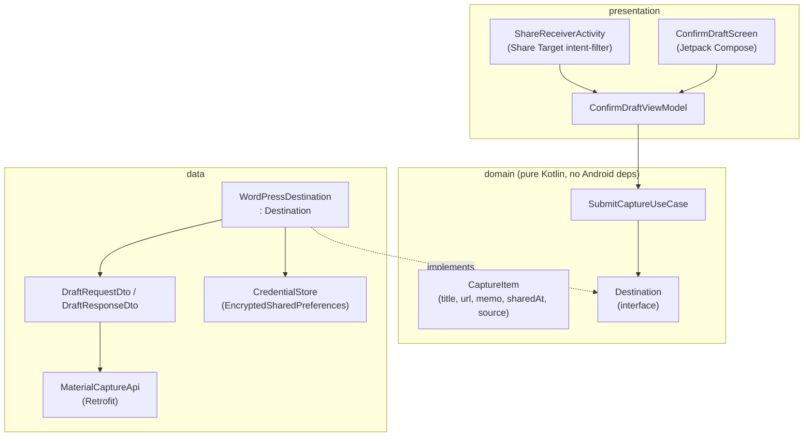
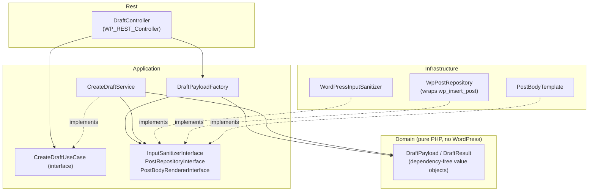
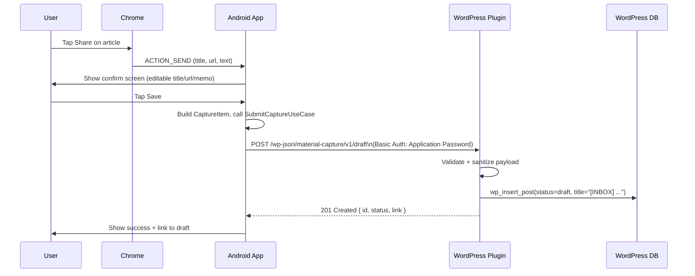

# Architecture

## Scope

This document covers the two components built by this project — the **Android capture app** and the **WordPress plugin** — plus the extension points that let the project grow beyond Android→WordPress without rearchitecting.

Everything from the WordPress draft onward (GitHub Actions → material note generation → Codex → article) is **existing, unchanged infrastructure** and is shown only as a boundary, not designed here.

## System context

```mermaid
flowchart LR
    subgraph phone["Android phone"]
        Chrome["Chrome / any app\n(Share sheet)"]
        App["wp-share-to-draft\nAndroid app"]
        Chrome -- "ACTION_SEND\n(title, url, text)" --> App
    end

    subgraph wp["WordPress site"]
        Plugin["material-capture plugin\nREST API"]
        Draft["Draft post\n[INBOX] Original Title"]
        Plugin --> Draft
    end

    subgraph existing["Existing pipeline (out of scope, unchanged)"]
        GHA["GitHub Actions"]
        Notes["Material notes"]
        Codex["Codex"]
        Article["Article"]
        GHA --> Notes --> Codex --> Article
    end

    App -- "HTTPS POST\n/wp-json/material-capture/v1/draft\n(Application Password)" --> Plugin
    Draft -.->|"existing trigger,\nnot part of this project"| GHA

    style existing fill:#eee,stroke:#999,stroke-dasharray: 5 5
```

## Design goals

1. **Android is the first client, not the only one.** The confirmation screen and networking layer must not assume Chrome, Android, or even a phone — a PWA share target or a server-side webhook should be able to reuse the same domain layer and API contract.
2. **WordPress is the first destination, not the only one.** The plugin's REST endpoint is the first implementation of a `Destination` concept; the Android app talks to an interface, not to WordPress directly.
3. **The plugin is standalone and deactivatable.** No theme coupling. Uninstalling it must not corrupt existing posts.
4. **Every layer is unit-testable without a device, a browser, or a live WordPress install.**

## Android app — Clean Architecture layering

- **presentation** depends on **domain** only.
- **domain** defines `Destination` as a port; it has zero knowledge of WordPress, Retrofit, or HTTP.
- **data** provides the first adapter (`WordPressDestination`). A future `GithubDestination`, `NotionDestination`, `SlackDestination`, or `WebhookDestination` is added here without touching presentation or domain.
- Dependency Injection (Hilt) wires the `Destination` binding at compile time; the specific implementation is swappable per build flavor or user setting later if multiple destinations are supported simultaneously.

## WordPress plugin — layering

Four layers: `Rest` (WordPress-aware entry point) → `Application` (orchestration + ports) → `Domain` (dependency-free value objects) and `Infrastructure` (WordPress adapters implementing Application's ports). Full detail, class signatures, and the review that produced this shape: [docs/phase2-wordpress-plugin-design.md](phase2-wordpress-plugin-design.md).

- `DraftController` is the only WordPress-aware entry point exposed as a route; it depends on the `CreateDraftUseCase` *interface*, never the concrete service, so it can be tested with a mock use case without fighting PHP's `final` keyword.
- `DraftPayload` (Domain) is a fully dependency-free value object — it validates its own basic invariants in plain PHP but knows nothing about WordPress or the sanitizer; sanitization is orchestrated once, in `Application/DraftPayloadFactory`, before a `DraftPayload` is ever constructed. This keeps the "Domain depends on interfaces only" rule honest — a value object depends on nothing at all.
- `CreateDraftService` (Application) contains the actual business rule ("build title as `[INBOX] {original}`, assign the pre-configured category, compose body, always as a draft") and is unit-testable against Mockery mocks of its two ports — no live WordPress needed.
- `WpPostRepository` (Infrastructure) is the only place that calls `wp_insert_post()` / `wp_set_object_terms()` / `term_exists()`, isolating WordPress core functions behind an interface so `Application`/`Domain` tests can run under plain PHPUnit (with Brain\Monkey stubs only where `Infrastructure`/`Rest` classes are themselves under test) instead of full WP integration tests.

## Extension points (why this shape supports the roadmap)

| Future addition | Where it plugs in | Why no rearchitecture needed |
|---|---|---|
| PWA share target | New presentation layer, same domain `CaptureItem` + API contract | Domain/data are Android-agnostic |
| Webhook capture source (e.g. server cron, email-to-webhook) | Calls the same `POST /draft` endpoint directly | REST API is the stable contract, not the Android app |
| GitHub / Notion / Obsidian / Slack destinations | New `Destination` implementations in `android/.../data/` (or a future shared Kotlin Multiplatform module) | `Destination` interface already decouples "capture" from "where it goes" |
| Custom post type instead of plain post | New strategy inside `CreateDraftService`, selected by request field | Service already owns "how a draft is built"; controller/API shape unaffected |
| AI tag suggestion, duplicate check, voice memo transcription | New use cases in Android `domain`, or new REST sub-endpoints in the plugin | Both layers already separate "capture UI" from "submission logic" |

## Data flow for a single share (happy path)

## Out of scope (explicitly)

- Anything after the WordPress draft is created (GitHub Actions trigger, material note generation, Codex, article authoring) — existing and unchanged.
- Multi-user / multi-tenant WordPress support in v1 — single site, single Application Password per Android install.
- Offline queueing/retry is deferred to a later phase (noted in [ROADMAP.md](../ROADMAP.md)); v1 assumes network available at share time and surfaces a clear error otherwise.
