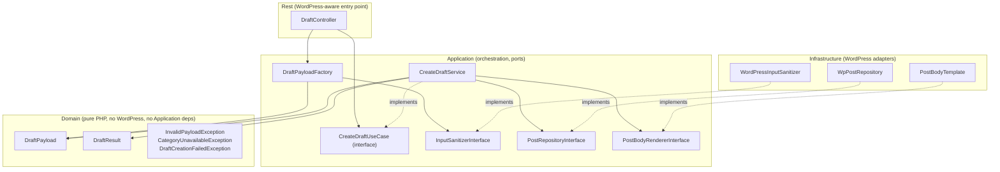

# Phase 2 Design — WordPress Plugin (`material-capture`)

**Status: awaiting review (revision 2).** This document is the reviewable design artifact for Phase 2a. No plugin code exists yet — per [ROADMAP.md](../ROADMAP.md#process), implementation (Phase 2b) starts only after this doc is explicitly approved. It refines [docs/architecture.md](architecture.md#wordpress-plugin--layering) and [docs/api-spec.md](api-spec.md) into concrete files, classes, and method signatures, without writing the implementation itself.

Revision 2 incorporates a design review that found several responsibility/dependency issues in revision 1 (Domain depending on Support, `final` classes slated for Mockery mocking, category lifecycle risks, ambiguous auth error ownership). See [Change log](#change-log-revision-1--revision-2) at the bottom for a summary of what moved.

## Plugin identity

| | |
|---|---|
| Plugin slug | `material-capture` |
| Bootstrap file | `material-capture.php` (packaged as `material-capture/material-capture.php` — see [Release packaging](#release-packaging-source-layout-vs-installed-plugin-folder)) |
| Text domain | `material-capture` |
| Minimum WP | 6.0 (Application Passwords stable since 5.6; 6.0 floor gives headroom on REST API maturity) |
| Minimum PHP | 8.1 (matches the dev-environment guidance already given: PHP 8.3 recommended, 8.1 as the floor for broader host compatibility) — **confirmed in review** |
| Namespace root | `MaterialCapture\` (PSR-4, autoloaded via Composer) |

## Layering

Four layers — deliberately not more, per the project's own "don't over-layer a WordPress plugin" guidance:



- **Domain** is pure PHP with zero WordPress and zero Application dependency — `DraftPayload` validates its own basic invariants (non-empty title, plausible URL shape) using plain PHP (`filter_var`), not `esc_url_raw` or any WordPress function. This is what fixed the review's core objection: in revision 1, `DraftPayload::fromArray()` took an `InputSanitizer` parameter, making the value object depend on `Support` — the very rule it was supposed to follow said Domain depends on interfaces only, and a value object shouldn't depend on anything at all beyond plain PHP.
- **Application** holds orchestration (`CreateDraftService`, `DraftPayloadFactory`) and the three ports (interfaces) that Infrastructure implements. Only the use case (`CreateDraftUseCase`) and the I/O ports are interfaces — `DraftPayloadFactory` itself stays a concrete class, since nothing needs to substitute it.
- **Infrastructure** is the only place WordPress functions are called.
- **Rest** is the WordPress-specific entry point; it depends on the `CreateDraftUseCase` interface and the concrete `DraftPayloadFactory`, never on `CreateDraftService` directly — this is what makes it possible to mock the use case in `DraftControllerTest` without fighting `final` (see [Testing philosophy](#testing-philosophy)).

## File layout

```
wordpress-plugin/
├── material-capture.php              # Plugin header, bootstrap, activation/deactivation hooks
├── uninstall.php                     # Runs on delete; removes plugin options ONLY (never category/posts)
├── composer.json                     # PSR-4 autoload: "MaterialCapture\\": "includes/"
├── includes/
│   ├── Plugin.php                    # Composition root: wires everything together
│   ├── Rest/
│   │   ├── DraftController.php       # WP_REST_Controller: route registration, arg schema, permission_callback
│   │   └── RestResponseFactory.php   # Builds success/error JSON shapes per api-spec.md
│   ├── Application/
│   │   ├── CreateDraftUseCase.php    # interface — what DraftController depends on
│   │   ├── CreateDraftService.php    # implements CreateDraftUseCase
│   │   ├── DraftPayloadFactory.php   # raw array -> DraftPayload (validation + sanitization orchestration)
│   │   ├── InputSanitizerInterface.php
│   │   ├── PostRepositoryInterface.php
│   │   └── PostBodyRendererInterface.php
│   ├── Domain/
│   │   ├── DraftPayload.php          # Pure value object — no WordPress, no Application deps
│   │   ├── DraftResult.php           # Pure value object
│   │   └── Exceptions/
│   │       ├── InvalidPayloadException.php
│   │       ├── CategoryUnavailableException.php
│   │       └── DraftCreationFailedException.php
│   └── Infrastructure/
│       ├── WordPressInputSanitizer.php  # implements InputSanitizerInterface
│       ├── WpPostRepository.php         # implements PostRepositoryInterface — only class calling wp_insert_post et al.
│       └── PostBodyTemplate.php         # implements PostBodyRendererInterface
└── tests/
    ├── bootstrap.php                 # Loads Composer autoload, PHPUnit bootstrap, Brain\Monkey + Mockery setup
    ├── Domain/
    │   └── DraftPayloadTest.php
    ├── Application/
    │   ├── CreateDraftServiceTest.php
    │   └── DraftPayloadFactoryTest.php
    ├── Infrastructure/
    │   └── WordPressInputSanitizerTest.php
    └── Rest/
        └── DraftControllerTest.php
```

## Class responsibilities & signatures

### `Plugin.php` (composition root)

```php
final class Plugin {
    public static function activate(): void;
    // Ensures the 素材候補 category exists (idempotent), stores its term id in the
    // `material_capture_category_id` option. Runs with the activating admin's elevated
    // context, per WordPress convention — this is the ONLY place a category is created.

    public static function deactivate(): void;
    // No-op. Deactivating must not touch posts, categories, or options.

    public function registerRoutes(): void;
    // Hooked to rest_api_init. Manually wires:
    //   $sanitizer = new WordPressInputSanitizer();
    //   $factory   = new DraftPayloadFactory($sanitizer);
    //   $service   = new CreateDraftService(new WpPostRepository(), new PostBodyTemplate());
    //   new DraftController($service, $factory) -- registered against the CreateDraftUseCase interface type
}
```

No DI container (per [docs/tech-decisions.md](tech-decisions.md#6-dependency-injection-hilt-android-manual-constructor-injection-php)) — manual wiring is small enough to read in one place.

### `Rest/DraftController.php`

```php
final class DraftController extends WP_REST_Controller {
    protected $namespace = 'material-capture/v1';
    protected $rest_base = 'draft';

    public function __construct(
        private CreateDraftUseCase $useCase,      // interface, not CreateDraftService
        private DraftPayloadFactory $payloadFactory,
    ) {}

    public function register_routes(): void;
    // registers POST /draft with WP arg schema for: title, url, shared_text, memo, source, shared_at

    public function permission_callback(WP_REST_Request $request): true|WP_Error;
    // 1. !is_ssl()                  -> WP_Error('https_required', ..., ['status' => 400])
    // 2. !current_user_can('edit_posts') -> WP_Error('insufficient_capability', ..., ['status' => 403])
    //    (an invalid/missing Application Password never reaches this method at all —
    //     see [Authentication & authorization: division of responsibility](#authentication--authorization-division-of-responsibility))
    // 3. otherwise -> true

    public function create_draft(WP_REST_Request $request): WP_REST_Response|WP_Error;
    // 1. $payload = $this->payloadFactory->fromArray($request->get_params())  [InvalidPayloadException -> 400]
    // 2. $result  = $this->useCase->create($payload, get_current_user_id())  [CategoryUnavailableException -> 409,
    //                                                                          DraftCreationFailedException -> 500]
    // 3. maps DraftResult -> 201 JSON per api-spec.md
}
```

`get_current_user_id()` is called here, in the WordPress-aware `Rest` layer, and passed into the use case as a plain `int` — `Application`/`Domain` never call WordPress functions themselves, including for "who is the current user."

Args schema (registered via WP's own REST arg validation — a first pass that gives free, uniform 400s for gross type errors; `DraftPayloadFactory` is the authoritative, WordPress-independent validator underneath it and is what unit tests exercise directly):

| arg | type | required | sanitize_callback |
|---|---|---|---|
| `title` | string | yes | `sanitize_text_field` |
| `url` | string | yes | `esc_url_raw` |
| `shared_text` | string | no | `sanitize_textarea_field` |
| `memo` | string | no | `sanitize_textarea_field` |
| `source` | string | no | `sanitize_key` |
| `shared_at` | string | no | passthrough (format-validated in `DraftPayloadFactory`, not here) |

### `Domain/DraftPayload.php` (pure value object)

```php
final class DraftPayload {
    private function __construct(
        public readonly string $title,
        public readonly string $url,
        public readonly ?string $sharedText,
        public readonly ?string $memo,
        public readonly string $source,
        public readonly ?DateTimeImmutable $sharedAt,
    ) {}

    /** @throws InvalidPayloadException */
    public static function create(
        string $title,
        string $url,
        ?string $sharedText,
        ?string $memo,
        string $source,
        ?DateTimeImmutable $sharedAt,
    ): self;
    // Plain-PHP invariant checks only (no WordPress, no InputSanitizer):
    //   - $title non-empty (trimmed), <= 300 chars (mb_strlen) -> missing_required_field / (length enforced upstream too)
    //   - $url non-empty, filter_var($url, FILTER_VALIDATE_URL) truthy, scheme is http/https -> invalid_url
    // Assumes inputs are already sanitized by the caller (DraftPayloadFactory) — this constructor
    // is the last line of defense on shape/invariants, not where sanitization happens.
}
```

This is the fix for the review's point 1: `DraftPayload` no longer knows `InputSanitizer` exists. Sanitization happens once, in `DraftPayloadFactory`, before `DraftPayload::create()` is ever called.

### `Application/DraftPayloadFactory.php`

```php
final class DraftPayloadFactory {
    public function __construct(private InputSanitizerInterface $sanitizer) {}

    /** @throws InvalidPayloadException */
    public function fromArray(array $data): DraftPayload {
        // 1. Sanitize each present field via $this->sanitizer (title/url/memo/sharedText/source)
        // 2. Parse shared_at if present: strict format check (see api-spec.md), else InvalidPayloadException('invalid_shared_at')
        // 3. Default source to 'unknown' if empty after sanitization
        // 4. Delegate remaining invariant checks to DraftPayload::create(...) and let its exceptions propagate
    }
}
```

### `Application/CreateDraftUseCase.php` / `CreateDraftService.php`

```php
interface CreateDraftUseCase {
    /** @throws CategoryUnavailableException|DraftCreationFailedException */
    public function create(DraftPayload $payload, int $authorId, ?DateTimeImmutable $now = null): DraftResult;
}

final class CreateDraftService implements CreateDraftUseCase {
    public function __construct(
        private PostRepositoryInterface $posts,
        private PostBodyRendererInterface $bodyRenderer,
    ) {}

    public function create(DraftPayload $payload, int $authorId, ?DateTimeImmutable $now = null): DraftResult {
        // 1. $now ??= new DateTimeImmutable();  -- plain PHP, not a WordPress call; tests inject a fixed value
        // 2. $categoryId = $this->posts->resolveConfiguredCategoryId();
        //    if null -> throw CategoryUnavailableException
        // 3. $title = str_starts_with($payload->title, '[INBOX] ') ? $payload->title : '[INBOX] ' . $payload->title;
        //    (idempotent prefixing -- a retried submission is not double-prefixed)
        // 4. $body = $this->bodyRenderer->render($payload, $now);
        // 5. $postId = $this->posts->insertDraft($title, $body, $categoryId, $authorId);
        //    (insertDraft's signature has no status parameter at all -- draft is not passed in, let alone overridable)
        // 6. return new DraftResult($postId, 'draft', $title, $this->posts->editLink($postId),
        //                            $this->posts->previewLink($postId), '素材候補', $now);
    }
}
```

`CreateDraftService` is no longer `final` in a way that blocks testing it *as a collaborator* — `DraftController` depends on the `CreateDraftUseCase` interface, so `DraftControllerTest` mocks the interface, not the (still `final`, still fine) concrete class. `CreateDraftServiceTest` itself doesn't need `CreateDraftService` to be non-final, since it's the thing under test, not the thing being mocked.

### `Application/PostRepositoryInterface.php` / `Infrastructure/WpPostRepository.php`

```php
interface PostRepositoryInterface {
    public function ensureCategoryOnActivation(string $name): int;
    // term_exists()/wp_insert_term() against the 'category' taxonomy. Called ONLY from Plugin::activate().

    public function resolveConfiguredCategoryId(): ?int;
    // Reads the `material_capture_category_id` option, re-verifies via term_exists($id, 'category').
    // Returns null if the option is unset or the term no longer exists -- never re-creates it implicitly.

    public function insertDraft(string $title, string $body, int $categoryId, int $authorId): int;
    // wp_insert_post(['post_title' => ..., 'post_content' => ..., 'post_status' => 'draft',
    //                 'post_author' => $authorId, 'post_category' => [$categoryId]], true)
    // 'draft' is a literal in this method's implementation, not a parameter.

    public function editLink(int $postId): ?string;    // get_edit_post_link($postId, 'raw') or null
    public function previewLink(int $postId): ?string;  // get_preview_post_link($postId) or null
}
```

Only `WpPostRepository` (Infrastructure) calls WordPress core functions. `CreateDraftServiceTest` uses a Mockery mock of `PostRepositoryInterface` — an interface mock, not a `final`-class mock, so no Mockery workarounds are needed.

### `Application/InputSanitizerInterface.php` / `Infrastructure/WordPressInputSanitizer.php`

```php
interface InputSanitizerInterface {
    public function sanitizeTitle(string $value): string;      // sanitize_text_field, then mb_substr to 300 chars
    public function sanitizeUrl(string $value): string;        // esc_url_raw, then mb_substr to 2048 chars
    public function sanitizeMemo(?string $value): ?string;     // sanitize_textarea_field, then mb_substr to 10,000 chars
    public function sanitizeSharedText(?string $value): ?string; // sanitize_textarea_field, then mb_substr to 50,000 chars
    public function sanitizeSource(?string $value): string;    // sanitize_key, empty -> 'unknown', mb_substr to 64 chars
}
```

### `Application/PostBodyRendererInterface.php` / `Infrastructure/PostBodyTemplate.php`

```php
interface PostBodyRendererInterface {
    public function render(DraftPayload $payload, DateTimeImmutable $createdAt): string;
}

final class PostBodyTemplate implements PostBodyRendererInterface {
    public function render(DraftPayload $payload, DateTimeImmutable $createdAt): string;
    // 元URL: {payload->url}
    // 保存日時: {createdAt, server time -- always present}
    // 共有日時: {payload->sharedAt, if not null -- otherwise this line is omitted}
    // 共有元: {payload->source}
    // メモ: {payload->memo ?? ''}
    //
    // {payload->sharedText, if present}
}
```

Takes `$createdAt` as a parameter rather than computing "now" itself — keeps it a pure formatter, fully deterministic in tests, and keeps the single source of truth for "now" in `CreateDraftService::create()`.

## Authentication & authorization: division of responsibility

Corrected in this revision — revision 1 had `DraftController` implicitly "generating" a 401 for bad credentials, which doesn't match how WordPress's own Application Password support actually works:

| Situation | Who decides | Mechanism |
|---|---|---|
| No `Authorization` header, or an invalid Application Password | **WordPress core** | WordPress's built-in Application Password authentication runs during REST bootstrap (`determine_current_user`), before `permission_callback` is ever invoked. If it fails, the request proceeds as an anonymous user; WordPress's own REST framework then produces its own standard error response — this plugin does not construct that body and should not claim ownership of its `code` or exact status in this document. |
| Authenticated, but lacks `edit_posts` | **This plugin** (`DraftController::permission_callback`) | `current_user_can('edit_posts')` is `false` → plugin-defined `WP_Error('insufficient_capability', ..., ['status' => 403])`. |
| Request not over HTTPS | **This plugin** (`DraftController::permission_callback`, checked first) | `is_ssl()` is `false` → plugin-defined `WP_Error('https_required', ..., ['status' => 400])`. Treated as a transport precondition, not an identity/authorization concern — hence its own code and a `400`, not folded into the 401/403 family. |

Practical effect: this plugin never invents an `invalid_credentials` code. Only `insufficient_capability` and `https_required` are this plugin's own error vocabulary in the 400/403 range; unauthenticated requests surface whatever WordPress core's REST layer already returns.

## Category lifecycle

Corrected in this revision — revision 1 created the category lazily on every request and considered deleting it on uninstall if empty; both were flagged as risky for a public plugin.

- **Created once, at activation**, by `Plugin::activate()` calling `ensureCategoryOnActivation('素材候補')`. The resulting term id is stored in the `material_capture_category_id` option.
- **Never created or re-created during request handling.** `CreateDraftService::create()` calls `resolveConfiguredCategoryId()`, which only reads and verifies the stored id. If it's missing (option never set) or stale (term was deleted from wp-admin), the request fails fast with `CategoryUnavailableException` → `409 category_unavailable` — the user gets an explicit, actionable error instead of the plugin silently recreating a category behind their back with API-caller-level permissions that may not even include `manage_categories`.
- **Recovery path for v1 (no admin UI):** deactivating and reactivating the plugin re-runs `Plugin::activate()`, which re-creates the category and refreshes the stored option. A dedicated admin screen to recreate or re-pick the category is a natural Phase 5+/6+ enhancement, not required for the MVP.
- **Never deleted by this plugin, ever** — not on deactivation, not on uninstall, regardless of whether the plugin created it or whether it currently has zero posts. A same-named category may predate the plugin, or be adopted by the site owner for unrelated use after the fact; name-based (or even "we created it") deletion heuristics were judged not worth the risk for a public OSS plugin. `uninstall.php` removes only `material_capture_category_id` and any other plugin-added options — never taxonomy terms, never posts.

## Error mapping (controller → api-spec.md)

| Domain condition | HTTP status | `code` |
|---|---|---|
| `title` or `url` missing/empty after sanitization | 400 | `missing_required_field` |
| `url` fails the `DraftPayload` invariant check | 400 | `invalid_url` |
| `shared_at` present but not a valid fixed-offset/`Z` timestamp | 400 | `invalid_shared_at` |
| Request not over HTTPS | 400 | `https_required` |
| No/invalid Application Password | *(WordPress core's own error)* | *(not this plugin's code — see [division of responsibility](#authentication--authorization-division-of-responsibility))* |
| Authenticated but lacks `edit_posts` | 403 | `insufficient_capability` |
| Configured category missing/deleted | 409 | `category_unavailable` |
| `wp_insert_post` returns `WP_Error` | 500 | `insert_failed` |

This table is the single source of truth the controller's catch blocks implement against, and must stay in sync with [api-spec.md](api-spec.md#endpoints) — any future change updates both together, per the docs-before-code rule.

## Test plan

### Tooling and roles (confirmed 2026-07-27)

- **PHPUnit** is the test runner for the whole suite.
- **Brain\Monkey** stubs and sets expectations on WordPress *functions and hooks* — `wp_insert_post`, `current_user_can`, `is_ssl`, `sanitize_text_field`, `add_action`, `term_exists`, `wp_set_object_terms`, etc. It owns anything that is a bare WordPress function call or hook registration, and is only used inside `Infrastructure/` tests and `Rest/DraftControllerTest` (the two places that actually touch WordPress functions).
- **Mockery** mocks *interfaces* this plugin defines — `CreateDraftUseCase`, `PostRepositoryInterface`, `InputSanitizerInterface`, `PostBodyRendererInterface`. Every Mockery target in this test plan is an interface, never a `final` concrete class, so there's no need for Mockery's alias/legacy-mocking workarounds.

### Testing philosophy

Tests target **this project's own behavior**, not WordPress's internals or its own sanitizer's correctness:

- Inputs → outputs (given a `DraftPayload`, does `CreateDraftService` build the right title/body/category and return the right `DraftResult`?).
- Post-generation rules (idempotent `[INBOX] ` prefix, server-side `draft` status with no override path, body template shape, server time vs. client-reported time).
- Error conversion (an invalid payload or a repository failure maps to the exact `code`/status in [Error mapping](#error-mapping-controller--api-specmd)).

Tests avoid over-asserting on *how many times* or *in what internal order* WordPress functions are called — that couples the suite to WordPress's implementation details rather than this plugin's contract.

### `InputSanitizer` testing is deliberately split (this was wrong in revision 1)

Revision 1's plan stubbed `sanitize_text_field()` to return a canned value and then asserted the sanitized output was "clean" — which only proves the stub returned what it was told to return, not that sanitization actually happened. Corrected split:

- **Unit test (`WordPressInputSanitizerTest`, Phase 2b):** verifies `WordPressInputSanitizer` *delegates to the right WordPress function* for each field (via Brain\Monkey's `Functions\expect(...)->once()`), and verifies **this plugin's own logic** that isn't WordPress's job — the `mb_substr` length truncation per field, and the `source` empty-string → `unknown` fallback. It does **not** re-assert that `sanitize_text_field` itself correctly strips a `<script>` tag — that's WordPress core's own tested behavior, not this plugin's.
- **Integration test (Phase 4a/4b, real WordPress):** exercises real adversarial inputs (script tags, malformed URLs, oversized strings) through the real WordPress sanitize functions and asserts the actual stored result. This is where "does sanitization really work end-to-end" gets answered, against real WordPress, not a stub standing in for it.

### Unit tests (Phase 2b Definition of Done — no live WordPress)

- `DraftPayloadTest`: valid input constructs successfully; empty `title` or `url` throws `InvalidPayloadException('missing_required_field')`; malformed `url` throws `InvalidPayloadException('invalid_url')`; `source` defaults to whatever the factory already resolved (this class doesn't invent defaults for fields the factory owns); `sharedAt` accepted as `null` or a `DateTimeImmutable`.
- `DraftPayloadFactoryTest` (Mockery mock of `InputSanitizerInterface`): each raw field is passed through the correct sanitizer method; a present-but-malformed `shared_at` string produces `InvalidPayloadException('invalid_shared_at')`; delegates remaining construction to `DraftPayload::create()` and lets its exceptions surface unchanged.
- `CreateDraftServiceTest` (Mockery mocks of `PostRepositoryInterface` and `PostBodyRendererInterface`): title is prefixed with `[INBOX] ` exactly once, including when the input title already has the prefix (idempotency); `resolveConfiguredCategoryId()` returning `null` surfaces as `CategoryUnavailableException`; `insertDraft` is invoked with the literal author id passed to `create()`; the returned `DraftResult` fields match the mocks' return values; a repository failure (mock throws) surfaces as `DraftCreationFailedException`.
- `WordPressInputSanitizerTest` (Brain\Monkey): see the split above — delegation + this plugin's own truncation/default logic only.
- `DraftControllerTest` (Brain\Monkey for `is_ssl`/`current_user_can`, Mockery for `CreateDraftUseCase` and `DraftPayloadFactory`): `permission_callback` returns `https_required` over plain HTTP, `insufficient_capability` when lacking the capability, and `true` otherwise; `create_draft` maps a successful `DraftResult` to the documented `201` shape and maps each domain exception to its documented status/code from the [Error mapping](#error-mapping-controller--api-specmd) table.

### Integration test scope (designed separately, gates Phase 4)

Unit tests above deliberately stop short of anything requiring a real WordPress runtime. Per the user's direction, integration tests — REST route registration, real Application Password authentication behavior, real WordPress capability checks, real `wp_insert_post`/sanitizer behavior — are **designed as their own reviewable document**. [ROADMAP.md](../ROADMAP.md) gates Phase 4 the same way as Phases 2/3: a **Phase 4a design sub-stage** produces `docs/phase4-integration-test-design.md` (test environment choice — e.g. `wp-env`/Docker —, scenarios, and pass/fail criteria) for review before any integration test is written or run.

## Release packaging: source layout vs. installed plugin folder

The repository keeps plugin source at `wordpress-plugin/` for consistency with the rest of this monorepo's top-level layout (`android/`, `docs/`, etc.). Installing that folder verbatim as `wp-content/plugins/wordpress-plugin/` would work but produces an unhelpful, generically-named plugin directory on a real WordPress install.

**Decision:** source stays at `wordpress-plugin/` in the repo; Phase 5's release process packages it into a zip whose internal top-level folder is `material-capture/` (i.e., the zip contains `material-capture/material-capture.php`, not `wordpress-plugin/material-capture.php`). This is a packaging-step concern, not a source-layout concern — added as an explicit Phase 5 Definition-of-Done item in [ROADMAP.md](../ROADMAP.md#phase-5--oss-launch) rather than renaming the source directory now.

## Non-goals for Phase 2

- No admin settings UI screen for the category (Application Password is generated/managed entirely through WordPress's own user profile screen; category recovery uses the deactivate/reactivate path described in [Category lifecycle](#category-lifecycle)).
- No application-level total request-body-size cap (see [api-spec.md](api-spec.md#endpoints) and [security.md](security.md#input-handling-wordpress-plugin) — left to server/WordPress configuration).
- No duplicate-URL detection, no custom post type, no tag suggestion — all explicitly Phase 6+ ([ROADMAP.md](../ROADMAP.md#phase-6--platform-expansion-post-launch)).
- No GitHub Actions CI for this plugin yet (Phase 5); Phase 2b DoD only requires PHPCS/PHPUnit runnable locally.

## Design decisions confirmed in review

**2026-07-27 (round 1):**
1. PHP minimum version: 8.1.
2. PHPUnit WP-stubbing: Brain\Monkey (+ Mockery for object collaborators).
3. `素材候補` is a standard `category` taxonomy term, not a custom taxonomy.

**2026-07-27 (round 2 — this revision):**
4. `Domain` must not depend on `Support`/`Application` at all — fixed by making `DraftPayload` a dependency-free value object and moving sanitization orchestration into a new `Application/DraftPayloadFactory`.
5. Only interfaces are Mockery targets (`CreateDraftUseCase`, `PostRepositoryInterface`, `InputSanitizerInterface`, `PostBodyRendererInterface`) — concrete `final` classes are never mocked.
6. `InputSanitizer` testing is split: unit tests check delegation + this plugin's own truncation/default logic; real sanitization correctness is verified in Phase 4 integration tests.
7. The `素材候補` category is never deleted by this plugin (deactivation or uninstall); it's created once at activation and re-verified (not re-created) per request.
8. Category creation moved out of per-request handling entirely — activation-only, with a fast, explicit `409 category_unavailable` failure if it's since become unavailable, instead of silent recreation.
9. `shared_at` (client-reported) and the post body's server creation time are distinct fields, both potentially present in the body, never conflated.
10. `shared_at` format is fixed: RFC 3339 timestamp with a required numeric offset or literal `Z`; anything else is rejected as `invalid_shared_at`, not guessed at.
11. Field max lengths specified explicitly (title 300 / url 2,048 / memo 10,000 / shared_text 50,000 / source 64), measured via `mb_strlen`.
12. No application-level total-body-size cap in v1 — the earlier 256 KB / `payload_too_large` design is dropped; per-field caps plus server/WordPress limits are considered sufficient.
13. `source` is a free-form `sanitize_key`-sanitized identifier, not a fixed allowlist — future capture sources don't require a plugin update to identify themselves.
14. `[INBOX] ` prefixing is idempotent (checked with `str_starts_with` before prefixing).
15. Authentication/authorization responsibility split clarified: WordPress core owns the "no/bad Application Password" case entirely; this plugin only defines `insufficient_capability` (403) and `https_required` (400).
16. `is_ssl()`'s dependence on correct reverse-proxy configuration is documented as an explicit operational requirement, not silently assumed.
17. Response shape changed from `link`/`edit_link` to `post_id`/`edit_url`/`preview_url` (nullable), dropping the plain permalink field since a draft's permalink usually isn't a useful URL to a human.
18. `post_author` is always explicitly set to the authenticated user on `wp_insert_post`.
19. Source stays at `wordpress-plugin/` in the repo; Phase 5 packaging produces a `material-capture/`-rooted release zip.

These are locked for Phase 2b implementation. Any further change must update this section (and `composer.json`'s `require.php` once written, for #1) before the corresponding code change.

## Change log (revision 1 → revision 2)

For readers comparing against the version already reviewed once: the core architectural shape (four small layers, ports for I/O, PHPUnit + Brain\Monkey + Mockery) is unchanged. What moved is summarized in the numbered list above (items 4–19) — in short, `Support/` was split into `Application/` (orchestration + ports) and `Infrastructure/` (WordPress adapters), `Domain/` was made fully dependency-free, category lifecycle was made activation-only and delete-never, and several API-shape details (response fields, error codes, field limits, timestamp format) were made concrete instead of left as "TBD."
