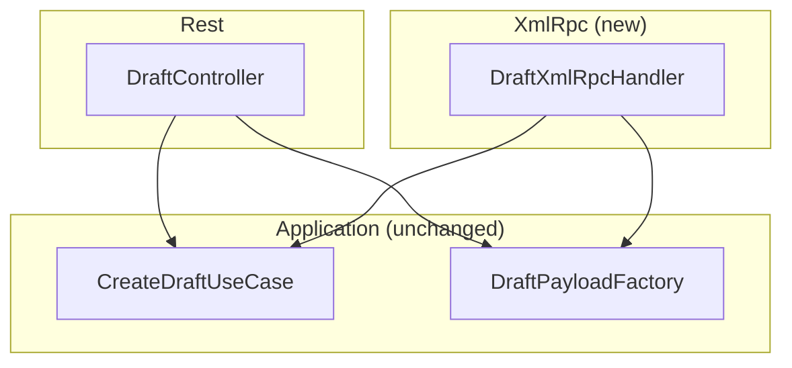

# Phase 2c Design — WordPress Plugin XML-RPC Fallback

**Status: approved (2026-07-30), proceeding to Phase 2d.** This document is the reviewable design artifact for Phase 2c. It refines [docs/tech-decisions.md #11](tech-decisions.md#11-xml-rpc-as-an-opt-in-fallback-transport), [docs/api-spec.md](api-spec.md#xml-rpc-fallback-material_capturecreatedraft), and [docs/security.md](security.md#xml-rpc-fallback-transport-phase-2c2d-designed-not-yet-built) into concrete classes and method signatures.

## Why this exists

Production smoke testing (Phase 3b) found that at least one real WordPress host does not forward the `Authorization` header to PHP, even with the documented `.htaccess` fix — REST's Application-Password-over-Basic-Auth cannot authenticate there at all. XML-RPC sends credentials as method-call parameters instead of an HTTP header, sidestepping that specific hosting limitation. See [docs/tech-decisions.md #11](tech-decisions.md#11-xml-rpc-as-an-opt-in-fallback-transport) for the full context and rejected alternatives.

## Layering (extends, does not replace, the Phase 2 layering)



`XmlRpc/DraftXmlRpcHandler` is a **second thin adapter** over the exact same `CreateDraftUseCase`/`DraftPayloadFactory` the REST controller already uses — see [docs/phase2-wordpress-plugin-design.md#layering](phase2-wordpress-plugin-design.md#layering). No changes to `Domain`/`Application`/`Infrastructure` are needed; this confirms that layering was the right call for exactly this kind of extension.

## File layout addition

```
wordpress-plugin/
├── includes/
│   ├── XmlRpc/                          # new
│   │   └── DraftXmlRpcHandler.php
│   └── ... (Rest/, Application/, Domain/, Infrastructure/ unchanged)
└── tests/
    └── XmlRpc/                          # new
        └── DraftXmlRpcHandlerTest.php
```

## Class design

### `XmlRpc/DraftXmlRpcHandler.php`

```php
final class DraftXmlRpcHandler {
    public function __construct(
        private readonly CreateDraftUseCase $useCase,
        private readonly DraftPayloadFactory $payloadFactory,
    ) {}

    /**
     * Registers this handler's method with WordPress's XML-RPC server.
     * Hooked to the `xmlrpc_methods` filter from Plugin.php, mirroring how
     * DraftController registers itself on `rest_api_init`.
     */
    public function registerMethod(array $methods): array {
        $methods['material_capture.createDraft'] = [$this, 'createDraft'];
        return $methods;
    }

    /**
     * @param array $args Positional params per docs/api-spec.md's XML-RPC section:
     *   [username, applicationPassword, title, url, sharedText, memo, source, sharedAt]
     */
    public function createDraft(array $args): array|IXR_Error {
        global $wp_xmlrpc_server;

        [$username, $password, $title, $url, $sharedText, $memo, $source, $sharedAt] =
            array_pad($args, 8, null);

        // WordPress core's own credential check -- Application Passwords work here
        // natively, not just for REST. A failure here is WordPress core's error, not
        // ours -- see docs/security.md's division of responsibility.
        if (!$wp_xmlrpc_server->login((string) $username, (string) $password)) {
            return $wp_xmlrpc_server->error;
        }

        if (!is_ssl()) {
            return new IXR_Error(400, 'This endpoint requires HTTPS.');
        }
        if (!current_user_can('edit_posts')) {
            return new IXR_Error(403, 'The authenticated user does not have permission to create posts.');
        }

        try {
            $payload = $this->payloadFactory->fromArray([
                'title' => $title,
                'url' => $url,
                'shared_text' => $sharedText,
                'memo' => $memo,
                'source' => $source,
                'shared_at' => $sharedAt,
            ]);
        } catch (InvalidPayloadException $exception) {
            return new IXR_Error(400, $exception->getMessage());
        }

        try {
            $result = $this->useCase->create($payload, get_current_user_id());
        } catch (CategoryUnavailableException $exception) {
            return new IXR_Error(409, $exception->getMessage());
        } catch (DraftCreationFailedException $exception) {
            return new IXR_Error(500, $exception->getMessage());
        }

        return [
            'post_id' => $result->postId,
            'status' => $result->status,
            'title' => $result->title,
            'edit_url' => $result->editUrl,
            'preview_url' => $result->previewUrl,
            'category' => $result->category,
            'created_at' => $result->createdAt->format(DATE_ATOM),
        ];
    }
}
```

Deliberately **not** a `WP_REST_Controller`-style class — WordPress's XML-RPC server has its own convention (a plain class with a method matching the registered callback signature), so `DraftXmlRpcHandler` follows that convention rather than forcing REST's shape onto it. The response-building (success struct, `IXR_Error` construction) is small enough here that a separate `XmlRpcResponseFactory` (mirroring REST's `RestResponseFactory`) isn't warranted yet — revisit only if this class grows.

**Corrected during implementation (2026-07-31):** the original draft of this doc gave `createDraft` a `(array $args, wp_xmlrpc_server $server)` signature, modeled loosely on `DraftController`'s `(WP_REST_Request $request)` shape. This was wrong: WordPress's real XML-RPC dispatcher (`IXR_Server::call()`) invokes `xmlrpc_methods` callbacks as `call_user_func($callback, $args)` — a single argument, never a second server instance. The two-argument signature caused a fatal `ArgumentCountError` on every real call (WordPress's own fatal-error handler caught it and returned a generic `faultCode 500` — this is what production testing against dopodomani.biz surfaced, distinct from the `xmlrpc_init` issue above). Fixed by dropping the second parameter and reaching the active server via the `$wp_xmlrpc_server` global instead, matching WordPress's own Codex examples for custom XML-RPC methods.

### `Plugin.php` changes

```php
public function registerRoutes(): void {
    // existing REST wiring unchanged
    ...
}

public function registerXmlRpcMethods(): void {
    $handler = new DraftXmlRpcHandler(
        new CreateDraftService(new WpPostRepository(), new PostBodyTemplate()),
        new DraftPayloadFactory(new WordPressInputSanitizer()),
    );
    add_filter('xmlrpc_methods', [$handler, 'registerMethod']);
}
```

**Corrected during implementation (2026-07-31):** the original draft of this doc proposed `add_action('xmlrpc_init', [$plugin, 'registerXmlRpcMethods']);` in the bootstrap. **WordPress core has no `xmlrpc_init` action** — `xmlrpc_methods` is a plain filter, only ever applied by core when `xmlrpc.php` itself constructs its server. Hooking a nonexistent action meant `registerXmlRpcMethods()` was never called and the method silently never registered — caught via manual production verification (`system.listMethods` didn't list `material_capture.createDraft`, even though the REST route was confirmed present). Fixed by calling `(new Plugin())->registerXmlRpcMethods()` unconditionally at plugin load time in `material-capture.php`, with no wrapping action — the standard pattern (this is how core plugins like Jetpack add their own XML-RPC methods too).

## Error mapping (extends the REST table in docs/api-spec.md)

Already fully specified in [docs/api-spec.md's XML-RPC section](api-spec.md#xml-rpc-fallback-material_capturecreatedraft) — this doc doesn't repeat it, since the source of truth for wire-level codes belongs there, matching how Phase 2's REST error table works.

## Test plan

Same tooling and philosophy as [docs/phase2-wordpress-plugin-design.md#test-plan](phase2-wordpress-plugin-design.md#test-plan): PHPUnit + Brain\Monkey (for `is_ssl`, `current_user_can`, `get_current_user_id`, and stubbing the `wp_xmlrpc_server`/`IXR_Error` types) + Mockery (for `CreateDraftUseCase`, mocked as an interface, not `DraftPayloadFactory`'s concrete class — reusing the exact same pattern `DraftControllerTest` already established).

- `DraftXmlRpcHandlerTest`:
  - `login()` failure on the (mocked) `wp_xmlrpc_server` → returns `$server->error` unchanged, use case never called
  - Plain HTTP (`is_ssl` stubbed false) → `IXR_Error(400, ...)`, use case never called
  - Missing `edit_posts` capability → `IXR_Error(403, ...)`
  - Invalid payload (missing title/url) → `IXR_Error(400, ...)` with the real `DraftPayloadFactory` (not mocked, same approach as `DraftControllerTest`'s "missing url" test) rejecting it for real
  - `CategoryUnavailableException`/`DraftCreationFailedException` from the (mocked) use case → `IXR_Error(409, ...)` / `IXR_Error(500, ...)` respectively
  - Successful case → struct with all seven fields matching the mocked `DraftResult`

Deferred to Phase 4 (or a manual production check, given this feature exists specifically because of one real host's behavior): confirming `wp_xmlrpc_server::login()` actually accepts a real Application Password end-to-end. This is the one place this design doc recommends a manual production verification step *in addition to* Phase 4's normal scope, since the entire feature's premise rests on an assumption (Application Passwords work for WordPress core's XML-RPC authentication) that should be confirmed empirically against the real host before considering Phase 2d done.

## Non-goals for Phase 2d

- No other WordPress core XML-RPC methods (`wp.newPost`, etc.) are touched, wrapped, or exposed by this plugin — only the one custom method.
- No change to whether XML-RPC is enabled/disabled on a site — this plugin neither enables nor disables `xmlrpc.php`, it only adds a method if the server is already reachable.
- No XML-RPC-specific rate limiting beyond what already applies to REST (same non-goal as [docs/api-spec.md#rate-limiting](api-spec.md#rate-limiting)).

## Resolved review questions (2026-07-30)

1. **Hook choice**: registers unconditionally via `xmlrpc_methods`, no `wp_is_application_passwords_available()` pre-check — `login()` failing naturally is enough, matching REST's own lack of a defensive pre-check for the equivalent condition.
2. **`IXR_Error` message localization**: English (developer-facing), matching `DraftController`'s existing REST error messages. `MaterialCaptureErrorMapper`/`toPresentation()` on the Android side already own all user-facing Japanese text regardless of transport.
