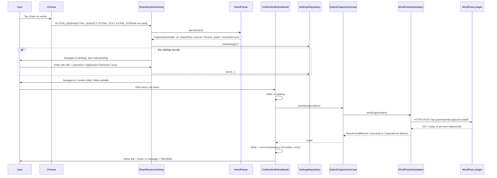
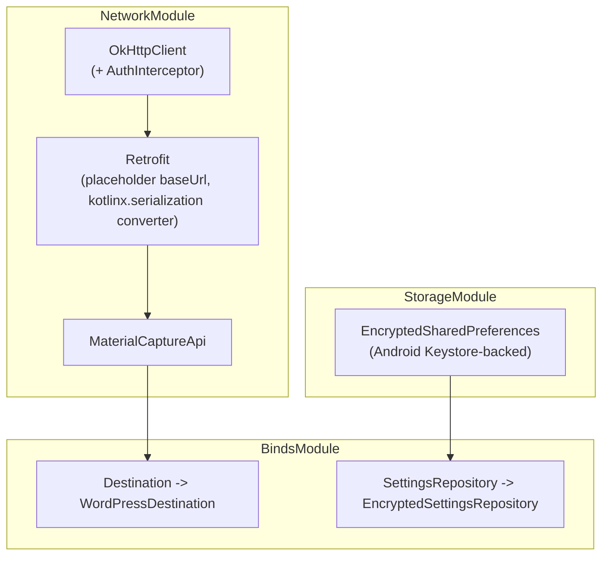
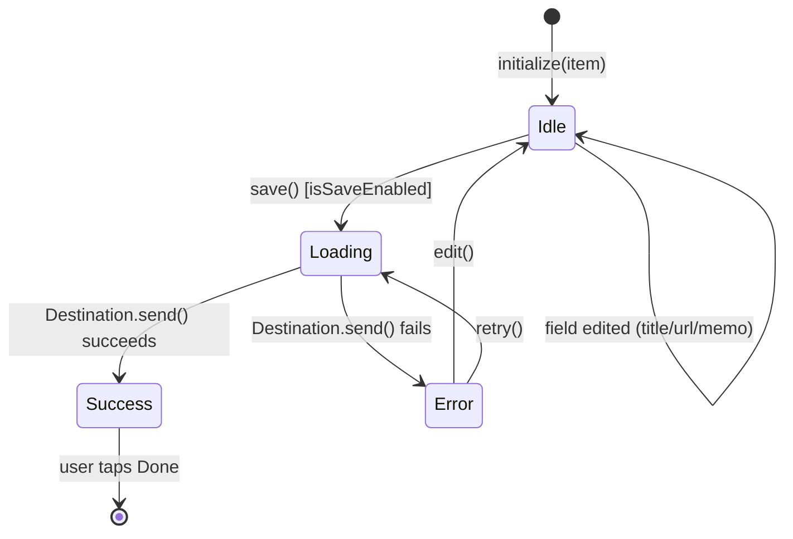

# Phase 3a Design — Android Share Target App

**Status: approved (revision 2).** Phase 3a was reviewed and approved with seven required refinements (see [Design decisions confirmed in review](#design-decisions-confirmed-in-review)); this revision incorporates all of them. No Android code exists yet — Phase 3b begins from this revision. It refines [docs/architecture.md](architecture.md#android-app--clean-architecture-layering), [docs/api-spec.md](api-spec.md), and [docs/security.md](security.md) into concrete screens, classes, and method signatures, without writing the implementation itself.

**Verification note carried into Phase 3b:** this project is developed across a main PC (full Android Studio/SDK/emulator) and a secondary PC (JDK + Gradle only, no Android SDK) — see [docs/development.md](development.md) for the full environment and AI-tool division of labor. This design is written so the `domain` and most of `presentation` (ViewModels, `IntentParser`, DTO mapping, error mapping) are plain-JVM code, buildable and unit-testable with just a JDK — only `Compose`/`Activity`/Hilt-`@AndroidEntryPoint`-annotated code and `EncryptedSharedPreferences`-backed storage require the Android Gradle Plugin and SDK. See [§9](#9-android-test-strategy) for exactly which tests run where, and [docs/development.md](development.md#what-works-with-and-without-the-android-sdk) for the general policy.

## App identity

| | |
|---|---|
| Package name | `io.github.dopodomani.wpsharetodraft` (per the project's own dev-setup notes: GitHub-username-based, not `com.example.*`) |
| Min SDK | 26 (Android 8.0) — covers Share Target intent-filter behavior consistently and >95% of active devices as of 2026; no feature in this design needs anything newer |
| Target/compile SDK | Latest stable at implementation time |
| UI toolkit | Jetpack Compose (per [docs/tech-decisions.md](tech-decisions.md#4-kotlin--native-share-target-not-a-wrapped-web-view)) |
| DI | Hilt (per [docs/tech-decisions.md](tech-decisions.md#6-dependency-injection-hilt-android-manual-constructor-injection-php)) |
| Networking | Retrofit + OkHttp (per [docs/tech-decisions.md](tech-decisions.md#7-networking-retrofit--okhttp-android)) |

## 1. Screen transition diagram

One Activity (`ShareReceiverActivity`), hosting two Compose destinations via Navigation Compose. There is no separate "main app" Activity — this app is share-target-first, per the original design brief — but the same Activity also answers a normal launcher intent so a user can reach Settings without sharing anything first.

```mermaid
stateDiagram-v2
    [*] --> RouteDecision: App launched

    state RouteDecision <<choice>>
    RouteDecision --> Settings: Launched from icon (ACTION_MAIN),\nor ACTION_SEND with no saved settings
    RouteDecision --> Confirm: ACTION_SEND with settings already saved

    Settings --> Confirm: Settings saved AND a shared item is pending
    Settings --> Settings: Launched from icon with nothing pending\n(stays here; this IS the destination)

    state Confirm {
        [*] --> Idle
        Idle --> Loading: Tap Save
        Loading --> Success: 201 Created
        Loading --> Error: Any error (see §7)
        Error --> Idle: Tap Edit
        Error --> Loading: Tap Retry
    }

    Success --> [*]: Tap Done (finish activity)
    Confirm --> [*]: Tap Cancel (finish activity, discard)
```



**Design decision (confirmed in review):** the original brief (Phase 1) only described Share → Confirm → Save; it didn't call for a Settings screen. One is unavoidable in an OSS app that must work against *any* user's WordPress site (site URL, username, and Application Password can't be hardcoded per [docs/security.md](security.md#credential-storage-android)). Confirmed minimal shape: a single `Settings` destination (site URL + username + Application Password, "Save" writes to `SettingsRepository` — see §4) reused both for first-run setup and later edits, reachable either automatically (no settings saved yet) or by relaunching the app icon. No separate onboarding wizard, no in-app browser for creating the Application Password (the guide in [docs/phase2-smoke-test-guide.md](phase2-smoke-test-guide.md#5-creating-an-application-password) covers that manually, in wp-admin, until/unless a future phase automates it).

## 2. Share Target flow



### `IntentParser` — independent, unit-testable Intent → `CaptureItem` translation

**Confirmed in review:** intent parsing is its own class, not inline logic in `ShareReceiverActivity`. This is the one piece of `presentation` that touches raw Android `Intent` extras, so isolating it is what makes it possible to unit-test the URL-extraction heuristic (§2's table below) directly, without instantiating an `Activity` — a plain input (`Intent` extras as data) → output (`CaptureItem`) function is trivially testable, whereas the same logic buried in an `Activity.onCreate()` would not be.

```kotlin
// presentation — touches android.content.Intent, but nothing else Android-specific
// (no Context, no lifecycle, no view). Still not domain: it exists to interpret THIS
// platform's intent shape, and a future PWA/webhook capture source would not have one.
class IntentParser @Inject constructor(
    private val clock: Clock,   // java.time.Clock, injected so tests can fix "now" — not an Android type
) {
    fun parse(intent: Intent): CaptureItem
}
```

Extraction rules (unchanged from revision 1, now scoped to this one class instead of being inline in the Activity):

| Source | Maps to |
|---|---|
| `Intent.EXTRA_SUBJECT` | `CaptureItem.title` (falls back to `Intent.EXTRA_TEXT`'s first line, or an empty string requiring the user to fill it in on the Confirm screen, if `EXTRA_SUBJECT` is absent — Chrome's share sheet doesn't always populate it consistently) |
| A URL found within `Intent.EXTRA_TEXT` (via a plain-Kotlin regex/`Patterns.WEB_URL` match) | `CaptureItem.url` |
| The remainder of `Intent.EXTRA_TEXT` (with the matched URL removed) | `CaptureItem.sharedText` |
| (fixed) | `CaptureItem.source = "chrome_share"` — free-form per [api-spec.md](api-spec.md#endpoints), matches the value this Android client identifies itself with |
| `clock.instant()` at extraction time | `CaptureItem.sharedAt` |

If no URL can be found in the shared content at all, `IntentParser` still returns a `CaptureItem` with `url = ""`, and the Confirm screen opens with that field empty and editable — matching the API's requirement that `url` be present, enforced client-side before enabling the Save button (see §7) rather than only failing server-side. `IntentParser` never throws for "couldn't find a URL" — that's an expected, user-correctable case, not an error condition (see [§9](#9-android-test-strategy) for `IntentParserTest`).

### `CaptureItem` — the central domain model

**Confirmed in review:** `CaptureItem` is the one model every layer converges on, and is treated as such deliberately, mirroring `DraftPayload`'s role on the WordPress side ([docs/phase2-wordpress-plugin-design.md](phase2-wordpress-plugin-design.md#domaindraftpayloadphp-pure-value-object)):

```kotlin
// domain — no Android, Retrofit, or Compose imports
data class CaptureItem(
    val title: String,
    val url: String,
    val sharedText: String?,
    val memo: String?,
    val source: String,
    val sharedAt: Instant,
)
```

`IntentParser` *produces* one, `ConfirmDraftUiState.Idle`/`Loading`/`Error` all *carry* one (the single piece of state the Confirm screen edits), `SubmitCaptureUseCase.submit()` and `Destination.send()` both *take* one as their sole input, and `DraftRequestDto.from()` is the one place it's translated into wire shape. No layer above `data` ever constructs a `DraftRequestDto` directly or reaches into Retrofit/OkHttp types — `CaptureItem` is the only shape `domain` and `presentation` need to know about.

## 3. ViewModel construction

Two `@HiltViewModel`s, one per destination:

```kotlin
@HiltViewModel
class SettingsViewModel @Inject constructor(
    private val settingsRepository: SettingsRepository,
) : ViewModel() {
    val uiState: StateFlow<SettingsUiState>

    fun onSiteUrlChanged(value: String)
    fun onUsernameChanged(value: String)
    fun onApplicationPasswordChanged(value: String)
    fun save()  // validates non-empty + https, then settingsRepository.save(...), emits SettingsUiState.Saved
}

sealed interface SettingsUiState {
    data class Editing(
        val siteUrl: String = "",
        val username: String = "",
        val applicationPassword: String = "",
        val validationError: String? = null,
    ) : SettingsUiState
    data object Saved : SettingsUiState
}
```

```kotlin
@HiltViewModel
class ConfirmDraftViewModel @Inject constructor(
    private val submitCaptureUseCase: SubmitCaptureUseCase,
) : ViewModel() {
    val uiState: StateFlow<ConfirmDraftUiState>

    fun initialize(item: CaptureItem)   // called once, from ShareReceiverActivity, with the parsed intent data
    fun onTitleChanged(value: String)
    fun onUrlChanged(value: String)
    fun onMemoChanged(value: String)
    fun save()    // State -> Loading, launches submitCaptureUseCase in viewModelScope, then Success/Error
    fun retry()   // re-runs save() with the same (possibly since-edited) item
    fun edit()    // Error -> Idle, keeping the item and its edits
}

sealed interface ConfirmDraftUiState {
    data class Idle(val item: CaptureItem, val isSaveEnabled: Boolean) : ConfirmDraftUiState
    data class Loading(val item: CaptureItem) : ConfirmDraftUiState
    data class Success(val result: DraftResult) : ConfirmDraftUiState
    data class Error(val item: CaptureItem, val error: CaptureError) : ConfirmDraftUiState
}
```

Both ViewModels expose only a single `StateFlow` of a sealed UI-state type to their Composable — no separate loading/error boolean flags alongside a data field, so the Composable can never render an inconsistent combination (e.g. "loading" and "error" both true). This directly implements §8.

## 4. Repository construction

This project names its remote data-access port `Destination`, not `Repository` — a deliberate choice recorded in [docs/tech-decisions.md](tech-decisions.md#5-clean-architecture--explicit-destination-interface) so that adding GitHub/Notion/Slack/Webhook sinks later is a new `Destination` implementation, not a rename. It plays the same architectural role a "Repository" would.

**Confirmed in review:** local (on-device) configuration is organized as **`SettingsRepository`**, not `CredentialRepository` as in revision 1. The stored value (site URL + username + Application Password) is broader than "credentials" — the site URL isn't a secret, only the username/password pair is — and `SettingsRepository` names the responsibility ("manage this app's configuration") rather than one narrower thing it happens to hold. The stored value type is renamed to match: `AppSettings`, not `Credentials`.

```kotlin
// domain — no Android or networking imports
interface Destination {
    suspend fun send(item: CaptureItem): Result<DraftResult>
}

interface SettingsRepository {
    suspend fun hasSettings(): Boolean
    suspend fun get(): AppSettings?          // null if never configured
    suspend fun save(settings: AppSettings)
}

data class AppSettings(val siteUrl: String, val username: String, val applicationPassword: String)
```

```kotlin
// data — the only layer allowed to know about Retrofit, OkHttp, or EncryptedSharedPreferences
class WordPressDestination @Inject constructor(
    private val api: MaterialCaptureApi,
    private val settingsRepository: SettingsRepository,
    private val errorMapper: MaterialCaptureErrorMapper,
) : Destination {
    override suspend fun send(item: CaptureItem): Result<DraftResult> {
        val settings = settingsRepository.get()
            ?: return Result.failure(CaptureError.SettingsNotConfigured.asThrowable())

        return try {
            val url = "${settings.siteUrl}/wp-json/material-capture/v1/draft"
            val response = api.createDraft(url, DraftRequestDto.from(item))
            if (response.isSuccessful) {
                Result.success(response.body()!!.toDomain())
            } else {
                Result.failure(errorMapper.fromHttpError(response).asThrowable())
            }
        } catch (e: IOException) {
            Result.failure(errorMapper.fromException(e).asThrowable())   // SSL/DNS/timeout/generic split — see §7
        }
    }
}

class EncryptedSettingsRepository @Inject constructor(
    private val encryptedPrefs: SharedPreferences,  // provided by Hilt, already EncryptedSharedPreferences-backed
) : SettingsRepository {
    // Reads/writes site_url, username, application_password keys.
    // Never logged (see docs/security.md#credential-storage-android) -- no Log.d/Log.e touches these values anywhere in this class.
}
```

`WordPressDestination` never reads `Authorization`-header details itself — that's `AuthInterceptor`'s job (§5) — it only supplies the full request URL and body, keeping it focused on the one thing a `Destination` implementation should own: "how do I hand this `CaptureItem` to *this particular* sink."

## 5. Retrofit API

```kotlin
interface MaterialCaptureApi {
    @POST
    suspend fun createDraft(@Url url: String, @Body request: DraftRequestDto): Response<DraftResponseDto>
}
```

**Why `@Url` instead of a fixed `@POST("wp-json/material-capture/v1/draft")` on a fixed Retrofit `baseUrl`:** the site URL is only known at runtime (entered by the user in Settings, per §1's design decision — this app talks to *any* WordPress site, not one baked in at build time). Retrofit still requires a syntactically valid absolute `baseUrl` at construction time even when every call supplies its own `@Url`, so the injected `Retrofit` instance is built once with a harmless, never-actually-used placeholder (`https://placeholder.invalid/`), and `WordPressDestination` always supplies the real, full URL per call. This was chosen over an OkHttp interceptor that rewrites the request URL's host, because it's Retrofit's own documented mechanism for a dynamic/full URL and needs no request-mutation magic to reason about.

**DTOs** (mirroring [api-spec.md](api-spec.md#endpoints) exactly — this is the only place the wire JSON shape is allowed to leak into):

```kotlin
@Serializable
data class DraftRequestDto(
    val title: String,
    val url: String,
    @SerialName("shared_text") val sharedText: String?,
    val memo: String?,
    val source: String,
    @SerialName("shared_at") val sharedAt: String?,   // ISO 8601, matching docs/api-spec.md's required format
) {
    companion object {
        fun from(item: CaptureItem): DraftRequestDto
    }
}

@Serializable
data class DraftResponseDto(
    @SerialName("post_id") val postId: Long,
    val status: String,
    val title: String,
    @SerialName("edit_url") val editUrl: String?,
    @SerialName("preview_url") val previewUrl: String?,
    val category: String,
    @SerialName("created_at") val createdAt: String,
) {
    fun toDomain(): DraftResult
}
```

**JSON library — confirmed in review: `kotlinx.serialization`** (via `retrofit2-kotlinx-serialization-converter`), being Kotlin-native and requiring no reflection or annotation-processor step, over Moshi or Gson. Rationale recorded as an ADR in [docs/tech-decisions.md](tech-decisions.md#10-json-library-kotlinxserialization).

**Auth header injection** — an OkHttp application interceptor, not something each `Destination`/API call constructs itself:

```kotlin
class AuthInterceptor @Inject constructor(
    private val settingsRepository: SettingsRepository,
) : Interceptor {
    override fun intercept(chain: Interceptor.Chain): okhttp3.Response {
        val settings = runBlocking { settingsRepository.get() }
        val request = if (settings == null) {
            chain.request()
        } else {
            val basic = okhttp3.Credentials.basic(settings.username, settings.applicationPassword)
            chain.request().newBuilder().addHeader("Authorization", basic).build()
        }
        return chain.proceed(request)
    }
}
```

(`okhttp3.Credentials.basic(...)` — OkHttp's own Basic-Auth header builder, fully qualified here since it's unrelated to this app's own domain types; noted so it isn't mistaken for a stray import during implementation.)

## 6. Hilt DI



- **`NetworkModule`** (`@Provides`, `@Singleton`): builds the shared `OkHttpClient` (registers `AuthInterceptor`), the `Retrofit` instance (placeholder base URL, per §5), and `MaterialCaptureApi`.
- **`StorageModule`** (`@Provides`, `@Singleton`): builds the `EncryptedSharedPreferences` instance (Jetpack Security, Keystore-backed — per [docs/security.md](security.md#credential-storage-android)), exposed only as a plain `SharedPreferences` type so nothing outside `data/local` needs to know it's the encrypted variant.
- **`RepositoryModule`** (`@Binds`): `Destination → WordPressDestination`, `SettingsRepository → EncryptedSettingsRepository`. `@Binds` (interface-to-impl), not `@Provides`, since neither needs custom construction logic beyond `@Inject constructor`.
- ViewModels use `@HiltViewModel` + constructor injection, wired automatically by `hiltViewModel()` in the Compose navigation graph — no manual ViewModel factory code, unlike the WordPress plugin's manual composition root (Hilt makes a container appropriate here in a way it wasn't for the small PHP object graph — see [docs/tech-decisions.md](tech-decisions.md#6-dependency-injection-hilt-android-manual-constructor-injection-php) for why the two sides differ).

## 7. Error handling

```kotlin
sealed interface CaptureError {
    data class Validation(val field: String, val messageResId: Int) : CaptureError  // 400 missing_required_field / invalid_url / invalid_shared_at
    data object HttpsRequired : CaptureError                                         // 400 https_required
    data object Unauthenticated : CaptureError                                       // WordPress core's own 401 (see below)
    data object InsufficientCapability : CaptureError                                // 403 insufficient_capability
    data object CategoryUnavailable : CaptureError                                    // 409 category_unavailable
    data class ServerError(val detail: String?) : CaptureError                       // 500 insert_failed

    /** Confirmed in review: split out of a single NetworkUnavailable bucket, since each
     *  has a different likely cause and a different user-facing fix. */
    sealed interface Network : CaptureError {
        data object Timeout : Network       // java.net.SocketTimeoutException
        data object DnsFailure : Network    // java.net.UnknownHostException
        data object SslFailure : Network    // javax.net.ssl.SSLException (incl. SSLHandshakeException)
        data object Unreachable : Network   // any other IOException (connection refused, reset, etc.)
    }

    data object SettingsNotConfigured : CaptureError                                 // app-local: Settings never completed
    data class Unknown(val detail: String?) : CaptureError                           // anything unrecognized
}
```

`MaterialCaptureErrorMapper` (in `data`, alongside `WordPressDestination`) is the only place that inspects an HTTP status/body *or* a caught exception and picks a `CaptureError` — mirroring the WordPress plugin's own `RestResponseFactory`/error-table pattern, so the two sides of this API contract each have exactly one place mapping wire/exception shape to typed errors. It exposes two entry points used from `WordPressDestination` (§4): `fromHttpError(response): CaptureError` and `fromException(e: IOException): CaptureError`.

**HTTP response mapping:**

| HTTP status | Response `code` (if present) | `CaptureError` |
|---|---|---|
| 400 | `missing_required_field`, `invalid_url`, `invalid_shared_at` | `Validation` |
| 400 | `https_required` | `HttpsRequired` |
| 401 | *(WordPress core's own shape — no `code` this app defines; see [docs/phase2-wordpress-plugin-design.md](phase2-wordpress-plugin-design.md#authentication--authorization-division-of-responsibility))* | `Unauthenticated` |
| 403 | `insufficient_capability` | `InsufficientCapability` |
| 409 | `category_unavailable` | `CategoryUnavailable` |
| 500 | `insert_failed` | `ServerError` |

**Exception mapping** (`fromException`, `SSLException` checked before the generic `IOException` fallback):

| Caught exception | `CaptureError` |
|---|---|
| `java.net.SocketTimeoutException` | `Network.Timeout` |
| `java.net.UnknownHostException` | `Network.DnsFailure` |
| `javax.net.ssl.SSLException` (and subtypes, e.g. `SSLHandshakeException`) | `Network.SslFailure` |
| any other `IOException` | `Network.Unreachable` |

User-facing presentation (in `ConfirmDraftScreen`, driven by `ConfirmDraftUiState.Error.error`) — one short Japanese message plus the one relevant action per error, not a generic "something went wrong":

| `CaptureError` | Message | Primary action |
|---|---|---|
| `Validation` | Field-specific (e.g. "URLを確認してください") | Edit (return to Idle, field highlighted) |
| `HttpsRequired` | "サイトのURLがHTTPSではありません" | Edit (fix the site URL in Settings) |
| `Unauthenticated` | "認証に失敗しました。Application Passwordを確認してください" | Open Settings |
| `InsufficientCapability` | "投稿を作成する権限がありません" | Open Settings (switch account) |
| `CategoryUnavailable` | "素材候補カテゴリーが見つかりません。WordPress側の設定を確認してください" | Retry (in case it was just re-created) |
| `ServerError` | "サーバーエラーが発生しました" | Retry |
| `Network.Timeout` | "接続がタイムアウトしました" | Retry |
| `Network.DnsFailure` | "サイトのURLが見つかりません。URLを確認してください" | Edit (fix the site URL in Settings) |
| `Network.SslFailure` | "サイトの証明書を確認できませんでした" | Retry (transient) or Edit (persistent misconfiguration) |
| `Network.Unreachable` | "ネットワークに接続できません" | Retry |
| `SettingsNotConfigured` | *(not user-visible as an error — this routes straight to Settings per §1, before Confirm is ever shown)* | — |
| `Unknown` | "予期しないエラーが発生しました" | Retry |

## 8. State transitions (Loading / Success / Error)

Already introduced structurally in §3; this is the transition diagram (Confirm screen only — Settings only has `Editing`/`Saved`, no error state of its own beyond inline field validation):



Invariants this design intends to guarantee (worth stating explicitly, since they're what the ViewModel unit tests in §9 exist to check):

- `save()` is a no-op unless currently `Idle` with `isSaveEnabled == true` — no double-submission from a double-tap while `Loading`.
- `Loading` always carries the exact `item` that was submitted, so `Error` can offer `edit()` back to the same (not reset) field values.
- There is no state representing "loading AND has stale error text" or similar — each state's data is exactly what that state needs, nothing inherited from a previous state by accident.

## 9. Android test strategy

Mirrors the split already established for the WordPress plugin ([docs/phase2-wordpress-plugin-design.md](phase2-wordpress-plugin-design.md#test-plan)): fast, no-device unit tests are the Phase 3b Definition of Done; anything needing a real device or a real WordPress instance is Phase 4. The **SDK column** is new in this revision and is the direct answer to the multi-PC constraint in [docs/development.md](development.md) — it states plainly which rows the secondary (no-Android-SDK) PC can run and which need the main PC or CI.

| Layer | Test type | SDK needed? | Tooling | What it checks |
|---|---|---|---|---|
| `domain` (models, `Destination`/`SettingsRepository` interfaces, use cases) | JVM unit test | **No** — plain JDK + Gradle | JUnit5 + Kotlin, fakes (not mocks — the interfaces are small enough that hand-written fakes are clearer than a mocking DSL here) | `SubmitCaptureUseCase` calls `Destination.send()` with the item unchanged; a `Destination` failure propagates as-is (no swallowed/re-wrapped errors) |
| `IntentParser` | JVM unit test — **`IntentParserTest`**, confirmed in review | **No** — `android.content.Intent` and `android.util.Patterns` are part of the Android *framework* jar, which Robolectric (or a lightweight stub jar) makes usable without a device, but Robolectric itself still needs the Android SDK on the classpath at build time. So this one row is **the exception**: it needs the Android SDK to compile/run even though it's conceptually simple, unavoidable since it touches `Intent` directly | JUnit5 + Robolectric | Every row of §2's extraction table, across a matrix of realistic Chrome share-intent shapes (subject present/absent, URL embedded in text vs. absent entirely, extra whitespace); confirms `IntentParser` never throws for "no URL found" |
| `presentation` (ViewModels) | JVM unit test | **No** — plain JDK + Gradle | JUnit5, `kotlinx-coroutines-test` (`runTest`, `StandardTestDispatcher`), a fake `SubmitCaptureUseCase`/`SettingsRepository` | Every transition in §8's diagram, including the "no-op while Loading" invariant; `StateFlow` emissions asserted via Turbine |
| `data` (`WordPressDestination`, DTO mapping, `MaterialCaptureErrorMapper`) | JVM unit test, still no live WordPress | **No** — plain JDK + Gradle | JUnit5 + **MockWebServer** (OkHttp's own test server — an in-process fake HTTP server, not a live WordPress instance, so this still runs with no network/device) | Request is built with the correct method/headers/body for a given `CaptureItem`; each documented response (201 and every error status/code in §7's table) maps to the correct domain result; `MockWebServer.enableTls()` misconfiguration and a forced socket timeout confirm `fromException` picks `SslFailure`/`Timeout` correctly, not just a generic bucket |
| `data/local` (`EncryptedSettingsRepository`) | JVM/Robolectric unit test | **Yes** — Robolectric needs the Android SDK on the build classpath | Robolectric (to get a real `Context`/`SharedPreferences` without a device) | Save-then-read round-trips correctly; nothing under test ever calls `Log.*` with a settings value (a simple test double asserting no log calls, or a lint rule — exact mechanism TBD at implementation time) |
| `presentation` UI (Compose screens), Hilt wiring, `AndroidManifest.xml`/intent-filter correctness | Compile + instrumented/manual check | **Yes** — Android Gradle Plugin requires `compileSdk` | Compose UI testing / manual on emulator or device | Deferred to **Phase 4a/4b** for the manual/instrumented pass; the *compile* step (does the module build at all) still runs in Phase 3b, but only where the Android SDK is available (main PC or CI — see [docs/development.md](development.md)) |
| End-to-end (real device, real Chrome share, real WordPress) | Instrumented / manual | **Yes** | Espresso/UI Automator + a real or LocalWP/`wp-env` WordPress instance | Deferred entirely to **Phase 4a/4b**, mirroring the WordPress plugin's own integration-test gate — not part of Phase 3b's Definition of Done |

`ktlint` runs across all of `presentation`/`domain`/`data` as a separate, non-test check (per [ROADMAP.md](../ROADMAP.md#phase-3b--implementation-blocked-until-3a-is-approved)'s Phase 3b DoD), analogous to PHPCS on the WordPress side — `ktlint` itself is a plain JVM tool and needs no Android SDK, so it runs on either PC.

## Non-goals for Phase 3

- No in-app Application Password creation flow (opening wp-admin in a WebView, automating the "Add New Application Password" click) — the user does this manually in a browser, per [docs/phase2-smoke-test-guide.md](phase2-smoke-test-guide.md#5-creating-an-application-password). A future phase could add a "Open wp-admin" shortcut button from Settings, but that's additive.
- No offline queueing/retry-on-reconnect — per [docs/architecture.md](architecture.md#out-of-scope-explicitly), a share attempted with no network surfaces a `CaptureError.Network` variant immediately; the user can retry once reconnected, but nothing is queued in the background.
- No multi-site / multi-account support — one set of settings (`SettingsRepository` holds exactly one `AppSettings` value), matching the WordPress plugin's own single-site assumption ([docs/security.md](security.md#non-goals-for-v1)).
- No other `Destination` implementations yet (GitHub/Notion/Slack/Webhook) — explicitly Phase 6+ ([ROADMAP.md](../ROADMAP.md#phase-6--platform-expansion-post-launch)), the interface just needs to already support it without rework.

## Design decisions confirmed in review

**2026-07-28:**
1. **Settings screen** — the minimal single-screen shape under §1 (site URL + username + Application Password, reused for setup and edits) is approved as-is.
2. **JSON library: `kotlinx.serialization`** — confirmed over Moshi/Gson; ADR recorded in [docs/tech-decisions.md](tech-decisions.md#10-json-library-kotlinxserialization).
3. **Min SDK: 26** — confirmed.
4. **URL-extraction heuristic** — the `Patterns.WEB_URL`/regex-against-`EXTRA_TEXT` heuristic, with the Confirm screen's editable `url` field as the fallback for anything it can't confidently extract, is approved as an acceptable "best effort" contract.
5. **`SettingsRepository`, not `CredentialRepository`** — local configuration storage renamed to reflect that it manages more than just secrets (site URL is not sensitive; only username/Application Password are). Stored value type renamed `AppSettings` (was `Credentials`). Applied throughout this document (§3, §4, §5, §6, §9, Non-goals).
6. **`IntentParser` extracted as its own class** — intent-to-`CaptureItem` translation is no longer inline in `ShareReceiverActivity`; see the new subsection under §2. This is also what makes `IntentParserTest` (item 7) possible in the first place.
7. **`IntentParserTest` added** — see §9's test matrix. Flagged there as the one exception to "the secondary PC can run everything" (§9's SDK column), since Robolectric needs the Android SDK even for testing plain-Intent-shaped logic.
8. **Network error taxonomy** — `CaptureError.NetworkUnavailable` replaced by a `CaptureError.Network` sub-hierarchy (`Timeout`, `DnsFailure`, `SslFailure`, `Unreachable`), each with its own user-facing message/action; see §7.

These are locked for Phase 3b implementation. Any further change must update this section before the corresponding code change, per the same docs-before-code rule already applied to the WordPress plugin.
