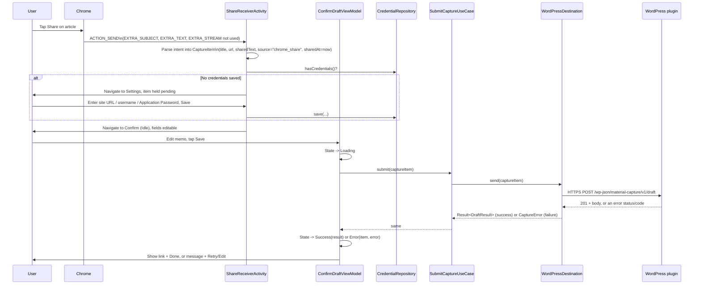
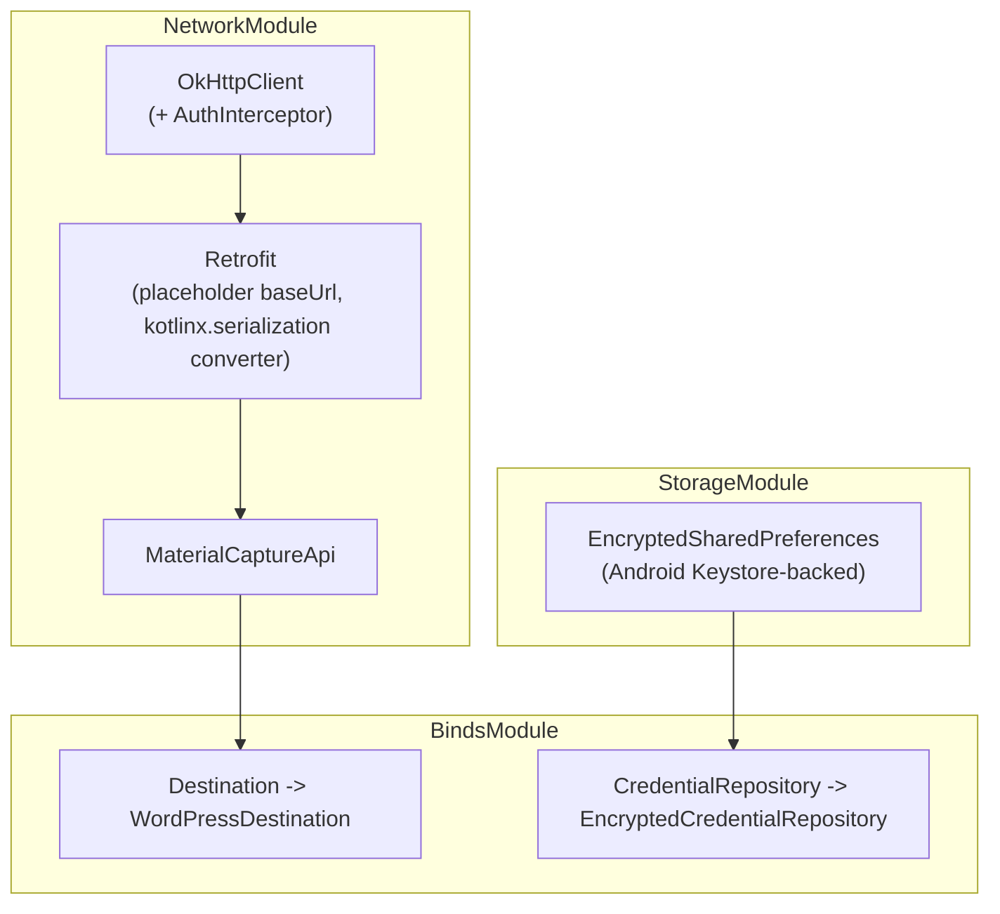
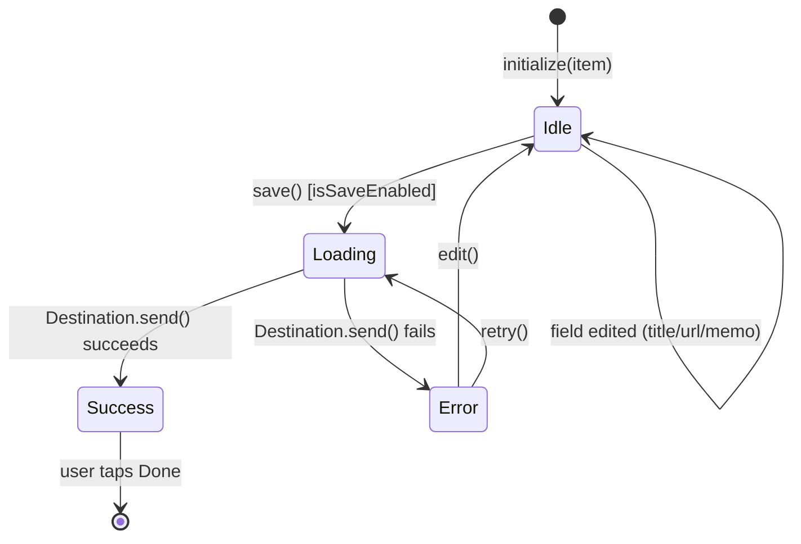

# Phase 3a Design — Android Share Target App

**Status: awaiting review.** This document is the reviewable design artifact for Phase 3a. No Android code exists yet — per [ROADMAP.md](../ROADMAP.md#process), implementation (Phase 3b) starts only after this doc is explicitly approved, exactly as Phase 2 was gated. It refines [docs/architecture.md](architecture.md#android-app--clean-architecture-layering), [docs/api-spec.md](api-spec.md), and [docs/security.md](security.md) into concrete screens, classes, and method signatures, without writing the implementation itself.

## App identity

| | |
|---|---|
| Package name | `io.github.dopodomani.wpsharetodraft` (per the project's own dev-setup notes: GitHub-username-based, not `com.example.*`) |
| Min SDK | 26 (Android 8.0) — covers Share Target intent-filter behavior consistently and >95% of active devices as of 2026; no feature in this design needs anything newer |
| Target/compile SDK | Latest stable at implementation time |
| UI toolkit | Jetpack Compose (per [docs/tech-decisions.md](tech-decisions.md#4-kotlin--native-share-target-not-a-wrapped-web-view)) |
| DI | Hilt (per [docs/tech-decisions.md](tech-decisions.md#6-dependency-injection-hilt-android-manual-constructor-injection-php)) |
| Networking | Retrofit + OkHttp (per [docs/tech-decisions.md](tech-decisions.md#7-networking-retrofit--okhttp-android)) |

## 1. Screen transition diagram

One Activity (`ShareReceiverActivity`), hosting two Compose destinations via Navigation Compose. There is no separate "main app" Activity — this app is share-target-first, per the original design brief — but the same Activity also answers a normal launcher intent so a user can reach Settings without sharing anything first.

```mermaid
stateDiagram-v2
    [*] --> RouteDecision: App launched

    state RouteDecision <<choice>>
    RouteDecision --> Settings: Launched from icon (ACTION_MAIN),\nor ACTION_SEND with no saved credentials
    RouteDecision --> Confirm: ACTION_SEND with credentials already saved

    Settings --> Confirm: Credentials saved AND a shared item is pending
    Settings --> Settings: Launched from icon with nothing pending\n(stays here; this IS the destination)

    state Confirm {
        [*] --> Idle
        Idle --> Loading: Tap Save
        Loading --> Success: 201 Created
        Loading --> Error: Any error (see §7)
        Error --> Idle: Tap Edit
        Error --> Loading: Tap Retry
    }

    Success --> [*]: Tap Done (finish activity)
    Confirm --> [*]: Tap Cancel (finish activity, discard)
```



**Design decision (flagged for review):** the original brief (Phase 1) only described Share → Confirm → Save; it didn't call for a Settings screen. One is unavoidable in an OSS app that must work against *any* user's WordPress site (site URL, username, and Application Password can't be hardcoded per [docs/security.md](security.md#credential-storage-android)). Proposed minimal shape: a single `Settings` destination (site URL + username + Application Password, "Save" writes to `CredentialRepository` — see §4) reused both for first-run setup and later edits, reachable either automatically (no credentials yet) or by relaunching the app icon. No separate onboarding wizard, no in-app browser for creating the Application Password (the guide in [docs/phase2-smoke-test-guide.md](phase2-smoke-test-guide.md#5-creating-an-application-password) covers that manually, in wp-admin, until/unless a future phase automates it). Confirm if this minimal shape is acceptable or if a different first-run flow is preferred.

## 2. Share Target flow



**Extracting the `CaptureItem` from the intent** (in `ShareReceiverActivity`, the one Android-framework-touching step before everything becomes plain domain data):

| Source | Maps to |
|---|---|
| `Intent.EXTRA_SUBJECT` | `CaptureItem.title` (falls back to `Intent.EXTRA_TEXT`'s first line, or an empty string requiring the user to fill it in on the Confirm screen, if `EXTRA_SUBJECT` is absent — Chrome's share sheet doesn't always populate it consistently) |
| A URL found within `Intent.EXTRA_TEXT` (via a plain-Kotlin regex/`Patterns.WEB_URL` match — not a WordPress or Android-specific concept, kept in `presentation` since it's about interpreting *this* platform's intent shape, not domain logic) | `CaptureItem.url` |
| The remainder of `Intent.EXTRA_TEXT` (with the matched URL removed) | `CaptureItem.sharedText` |
| (fixed) | `CaptureItem.source = "chrome_share"` — free-form per [api-spec.md](api-spec.md#endpoints), matches the value this Android client identifies itself with |
| `Instant.now()` at extraction time | `CaptureItem.sharedAt` |

If no URL can be found in the shared content at all, the Confirm screen still opens with `url` empty and editable — matching the API's requirement that `url` be present, enforced client-side before enabling the Save button (see §7) rather than only failing server-side.

## 3. ViewModel construction

Two `@HiltViewModel`s, one per destination:

```kotlin
@HiltViewModel
class SettingsViewModel @Inject constructor(
    private val credentialRepository: CredentialRepository,
) : ViewModel() {
    val uiState: StateFlow<SettingsUiState>

    fun onSiteUrlChanged(value: String)
    fun onUsernameChanged(value: String)
    fun onApplicationPasswordChanged(value: String)
    fun save()  // validates non-empty + https, then credentialRepository.save(...), emits SettingsUiState.Saved
}

sealed interface SettingsUiState {
    data class Editing(
        val siteUrl: String = "",
        val username: String = "",
        val applicationPassword: String = "",
        val validationError: String? = null,
    ) : SettingsUiState
    data object Saved : SettingsUiState
}
```

```kotlin
@HiltViewModel
class ConfirmDraftViewModel @Inject constructor(
    private val submitCaptureUseCase: SubmitCaptureUseCase,
) : ViewModel() {
    val uiState: StateFlow<ConfirmDraftUiState>

    fun initialize(item: CaptureItem)   // called once, from ShareReceiverActivity, with the parsed intent data
    fun onTitleChanged(value: String)
    fun onUrlChanged(value: String)
    fun onMemoChanged(value: String)
    fun save()    // State -> Loading, launches submitCaptureUseCase in viewModelScope, then Success/Error
    fun retry()   // re-runs save() with the same (possibly since-edited) item
    fun edit()    // Error -> Idle, keeping the item and its edits
}

sealed interface ConfirmDraftUiState {
    data class Idle(val item: CaptureItem, val isSaveEnabled: Boolean) : ConfirmDraftUiState
    data class Loading(val item: CaptureItem) : ConfirmDraftUiState
    data class Success(val result: DraftResult) : ConfirmDraftUiState
    data class Error(val item: CaptureItem, val error: CaptureError) : ConfirmDraftUiState
}
```

Both ViewModels expose only a single `StateFlow` of a sealed UI-state type to their Composable — no separate loading/error boolean flags alongside a data field, so the Composable can never render an inconsistent combination (e.g. "loading" and "error" both true). This directly implements §8.

## 4. Repository construction

This project names its remote data-access port `Destination`, not `Repository` — a deliberate choice recorded in [docs/tech-decisions.md](tech-decisions.md#5-clean-architecture--explicit-destination-interface) so that adding GitHub/Notion/Slack/Webhook sinks later is a new `Destination` implementation, not a rename. It plays the same architectural role a "Repository" would. Local (on-device) persistence *is* named `Repository`, since there's no equivalent future-multiplicity concern there.

```kotlin
// domain — no Android or networking imports
interface Destination {
    suspend fun send(item: CaptureItem): Result<DraftResult>
}

interface CredentialRepository {
    suspend fun hasCredentials(): Boolean
    suspend fun get(): Credentials?          // null if never configured
    suspend fun save(credentials: Credentials)
}

data class Credentials(val siteUrl: String, val username: String, val applicationPassword: String)
```

```kotlin
// data — the only layer allowed to know about Retrofit, OkHttp, or EncryptedSharedPreferences
class WordPressDestination @Inject constructor(
    private val api: MaterialCaptureApi,
    private val credentialRepository: CredentialRepository,
    private val errorMapper: MaterialCaptureErrorMapper,
) : Destination {
    override suspend fun send(item: CaptureItem): Result<DraftResult> {
        val credentials = credentialRepository.get()
            ?: return Result.failure(CaptureError.CredentialsNotConfigured.asThrowable())

        return try {
            val url = "${credentials.siteUrl}/wp-json/material-capture/v1/draft"
            val response = api.createDraft(url, DraftRequestDto.from(item))
            if (response.isSuccessful) {
                Result.success(response.body()!!.toDomain())
            } else {
                Result.failure(errorMapper.fromHttpError(response).asThrowable())
            }
        } catch (e: IOException) {
            Result.failure(CaptureError.NetworkUnavailable.asThrowable())
        }
    }
}

class EncryptedCredentialRepository @Inject constructor(
    private val encryptedPrefs: SharedPreferences,  // provided by Hilt, already EncryptedSharedPreferences-backed
) : CredentialRepository {
    // Reads/writes site_url, username, application_password keys.
    // Never logged (see docs/security.md#credential-storage-android) -- no Log.d/Log.e touches these values anywhere in this class.
}
```

`WordPressDestination` never reads `Authorization`-header details itself — that's `AuthInterceptor`'s job (§5) — it only supplies the full request URL and body, keeping it focused on the one thing a `Destination` implementation should own: "how do I hand this `CaptureItem` to *this particular* sink."

## 5. Retrofit API

```kotlin
interface MaterialCaptureApi {
    @POST
    suspend fun createDraft(@Url url: String, @Body request: DraftRequestDto): Response<DraftResponseDto>
}
```

**Why `@Url` instead of a fixed `@POST("wp-json/material-capture/v1/draft")` on a fixed Retrofit `baseUrl`:** the site URL is only known at runtime (entered by the user in Settings, per §1's design decision — this app talks to *any* WordPress site, not one baked in at build time). Retrofit still requires a syntactically valid absolute `baseUrl` at construction time even when every call supplies its own `@Url`, so the injected `Retrofit` instance is built once with a harmless, never-actually-used placeholder (`https://placeholder.invalid/`), and `WordPressDestination` always supplies the real, full URL per call. This was chosen over an OkHttp interceptor that rewrites the request URL's host, because it's Retrofit's own documented mechanism for a dynamic/full URL and needs no request-mutation magic to reason about.

**DTOs** (mirroring [api-spec.md](api-spec.md#endpoints) exactly — this is the only place the wire JSON shape is allowed to leak into):

```kotlin
@Serializable
data class DraftRequestDto(
    val title: String,
    val url: String,
    @SerialName("shared_text") val sharedText: String?,
    val memo: String?,
    val source: String,
    @SerialName("shared_at") val sharedAt: String?,   // ISO 8601, matching docs/api-spec.md's required format
) {
    companion object {
        fun from(item: CaptureItem): DraftRequestDto
    }
}

@Serializable
data class DraftResponseDto(
    @SerialName("post_id") val postId: Long,
    val status: String,
    val title: String,
    @SerialName("edit_url") val editUrl: String?,
    @SerialName("preview_url") val previewUrl: String?,
    val category: String,
    @SerialName("created_at") val createdAt: String,
) {
    fun toDomain(): DraftResult
}
```

**JSON library — flagged for review:** `kotlinx.serialization` (via `retrofit2-kotlinx-serialization-converter`) is proposed as the default, being Kotlin-native and requiring no reflection or annotation-processor step, over Moshi or Gson. No strong technical blocker to either alternative; naming it as a choice rather than assuming, per this project's own "don't guess on ambiguous points" rule.

**Auth header injection** — an OkHttp application interceptor, not something each `Destination`/API call constructs itself:

```kotlin
class AuthInterceptor @Inject constructor(
    private val credentialRepository: CredentialRepository,
) : Interceptor {
    override fun intercept(chain: Interceptor.Chain): okhttp3.Response {
        val credentials = runBlocking { credentialRepository.get() }
        val request = if (credentials == null) {
            chain.request()
        } else {
            val basic = Credentials.basic(credentials.username, credentials.applicationPassword)
            chain.request().newBuilder().addHeader("Authorization", basic).build()
        }
        return chain.proceed(request)
    }
}
```

(`okhttp3.Credentials.basic(...)` — OkHttp's own Basic-Auth header builder, unrelated to this app's domain `Credentials` data class above; naming collision noted so it isn't mistaken for a bug during implementation.)

## 6. Hilt DI



- **`NetworkModule`** (`@Provides`, `@Singleton`): builds the shared `OkHttpClient` (registers `AuthInterceptor`), the `Retrofit` instance (placeholder base URL, per §5), and `MaterialCaptureApi`.
- **`StorageModule`** (`@Provides`, `@Singleton`): builds the `EncryptedSharedPreferences` instance (Jetpack Security, Keystore-backed — per [docs/security.md](security.md#credential-storage-android)), exposed only as a plain `SharedPreferences` type so nothing outside `data/local` needs to know it's the encrypted variant.
- **`RepositoryModule`** (`@Binds`): `Destination → WordPressDestination`, `CredentialRepository → EncryptedCredentialRepository`. `@Binds` (interface-to-impl), not `@Provides`, since neither needs custom construction logic beyond `@Inject constructor`.
- ViewModels use `@HiltViewModel` + constructor injection, wired automatically by `hiltViewModel()` in the Compose navigation graph — no manual ViewModel factory code, unlike the WordPress plugin's manual composition root (Hilt makes a container appropriate here in a way it wasn't for the small PHP object graph — see [docs/tech-decisions.md](tech-decisions.md#6-dependency-injection-hilt-android-manual-constructor-injection-php) for why the two sides differ).

## 7. Error handling

```kotlin
sealed interface CaptureError {
    data class Validation(val field: String, val messageResId: Int) : CaptureError  // 400 missing_required_field / invalid_url / invalid_shared_at
    data object HttpsRequired : CaptureError                                         // 400 https_required
    data object Unauthenticated : CaptureError                                       // WordPress core's own 401 (see below)
    data object InsufficientCapability : CaptureError                                // 403 insufficient_capability
    data object CategoryUnavailable : CaptureError                                    // 409 category_unavailable
    data class ServerError(val detail: String?) : CaptureError                       // 500 insert_failed
    data object NetworkUnavailable : CaptureError                                     // IOException / timeout
    data object CredentialsNotConfigured : CaptureError                              // app-local: Settings never completed
    data class Unknown(val detail: String?) : CaptureError                           // anything unrecognized
}
```

`MaterialCaptureErrorMapper` (in `data`, alongside `WordPressDestination`) is the only place that inspects an HTTP status/body and picks a `CaptureError` — mirroring the WordPress plugin's own `RestResponseFactory`/error-table pattern, so the two sides of this API contract each have exactly one place mapping wire shape to typed errors:

| HTTP status | Response `code` (if present) | `CaptureError` |
|---|---|---|
| 400 | `missing_required_field`, `invalid_url`, `invalid_shared_at` | `Validation` |
| 400 | `https_required` | `HttpsRequired` |
| 401 | *(WordPress core's own shape — no `code` this app defines; see [docs/phase2-wordpress-plugin-design.md](phase2-wordpress-plugin-design.md#authentication--authorization-division-of-responsibility))* | `Unauthenticated` |
| 403 | `insufficient_capability` | `InsufficientCapability` |
| 409 | `category_unavailable` | `CategoryUnavailable` |
| 500 | `insert_failed` | `ServerError` |
| *(no HTTP response at all)* | — | `NetworkUnavailable` |

User-facing presentation (in `ConfirmDraftScreen`, driven by `ConfirmDraftUiState.Error.error`) — one short Japanese message plus the one relevant action per error, not a generic "something went wrong":

| `CaptureError` | Message | Primary action |
|---|---|---|
| `Validation` | Field-specific (e.g. "URLを確認してください") | Edit (return to Idle, field highlighted) |
| `HttpsRequired` | "サイトのURLがHTTPSではありません" | Edit (fix the site URL in Settings) |
| `Unauthenticated` | "認証に失敗しました。Application Passwordを確認してください" | Open Settings |
| `InsufficientCapability` | "投稿を作成する権限がありません" | Open Settings (switch account) |
| `CategoryUnavailable` | "素材候補カテゴリーが見つかりません。WordPress側の設定を確認してください" | Retry (in case it was just re-created) |
| `ServerError` | "サーバーエラーが発生しました" | Retry |
| `NetworkUnavailable` | "ネットワークに接続できません" | Retry |
| `CredentialsNotConfigured` | *(not user-visible as an error — this routes straight to Settings per §1, before Confirm is ever shown)* | — |
| `Unknown` | "予期しないエラーが発生しました" | Retry |

## 8. State transitions (Loading / Success / Error)

Already introduced structurally in §3; this is the transition diagram (Confirm screen only — Settings only has `Editing`/`Saved`, no error state of its own beyond inline field validation):



Invariants this design intends to guarantee (worth stating explicitly, since they're what the ViewModel unit tests in §9 exist to check):

- `save()` is a no-op unless currently `Idle` with `isSaveEnabled == true` — no double-submission from a double-tap while `Loading`.
- `Loading` always carries the exact `item` that was submitted, so `Error` can offer `edit()` back to the same (not reset) field values.
- There is no state representing "loading AND has stale error text" or similar — each state's data is exactly what that state needs, nothing inherited from a previous state by accident.

## 9. Android test strategy

Mirrors the split already established for the WordPress plugin ([docs/phase2-wordpress-plugin-design.md](phase2-wordpress-plugin-design.md#test-plan)): fast, no-device unit tests are the Phase 3b Definition of Done; anything needing a real device or a real WordPress instance is Phase 4.

| Layer | Test type | Tooling | What it checks |
|---|---|---|---|
| `domain` (models, `Destination`/`CredentialRepository` interfaces, use cases) | JVM unit test, no Android framework, no emulator | JUnit5 + Kotlin, fakes (not mocks — the interfaces are small enough that hand-written fakes are clearer than a mocking DSL here) | `SubmitCaptureUseCase` calls `Destination.send()` with the item unchanged; a `Destination` failure propagates as-is (no swallowed/re-wrapped errors) |
| `presentation` (ViewModels) | JVM unit test | JUnit5, `kotlinx-coroutines-test` (`runTest`, `StandardTestDispatcher`), a fake `SubmitCaptureUseCase`/`CredentialRepository` | Every transition in §8's diagram, including the "no-op while Loading" invariant; `StateFlow` emissions asserted via Turbine |
| `data` (`WordPressDestination`, DTO mapping, `MaterialCaptureErrorMapper`) | JVM unit test, still no live WordPress | JUnit5 + **MockWebServer** (OkHttp's own test server — an in-process fake HTTP server, not a live WordPress instance, so this still runs with no network/device) | Request is built with the correct method/headers/body for a given `CaptureItem`; each documented response (201 and every error status/code in §7's table) maps to the correct domain result; a dropped connection maps to `NetworkUnavailable` |
| `data/local` (`EncryptedCredentialRepository`) | JVM/Robolectric unit test | Robolectric (to get a real `Context`/`SharedPreferences` without a device) or a fake `SharedPreferences` | Save-then-read round-trips correctly; nothing under test ever calls `Log.*` with a credential value (a simple test double asserting no log calls, or a lint rule — exact mechanism TBD at implementation time) |
| End-to-end (real device, real Chrome share, real WordPress) | Instrumented / manual | Espresso/UI Automator + a real or LocalWP/`wp-env` WordPress instance | Deferred entirely to **Phase 4a/4b**, mirroring the WordPress plugin's own integration-test gate — not part of Phase 3b's Definition of Done |

`ktlint` runs across all of `presentation`/`domain`/`data` as a separate, non-test check (per [ROADMAP.md](../ROADMAP.md#phase-3b--implementation-blocked-until-3a-is-approved)'s Phase 3b DoD), analogous to PHPCS on the WordPress side.

## Non-goals for Phase 3

- No in-app Application Password creation flow (opening wp-admin in a WebView, automating the "Add New Application Password" click) — the user does this manually in a browser, per [docs/phase2-smoke-test-guide.md](phase2-smoke-test-guide.md#5-creating-an-application-password). A future phase could add a "Open wp-admin" shortcut button from Settings, but that's additive.
- No offline queueing/retry-on-reconnect — per [docs/architecture.md](architecture.md#out-of-scope-explicitly), a share attempted with no network surfaces `NetworkUnavailable` immediately; the user can retry once reconnected, but nothing is queued in the background.
- No multi-site / multi-account support — one set of credentials (`CredentialRepository` holds exactly one `Credentials` value), matching the WordPress plugin's own single-site assumption ([docs/security.md](security.md#non-goals-for-v1)).
- No other `Destination` implementations yet (GitHub/Notion/Slack/Webhook) — explicitly Phase 6+ ([ROADMAP.md](../ROADMAP.md#phase-6--platform-expansion-post-launch)), the interface just needs to already support it without rework.

## Open questions for review

1. **Settings screen's existence and shape** — see the design decision under §1. Confirm the minimal single-screen approach (site URL + username + Application Password, reused for setup and edits) is acceptable.
2. **JSON library** — `kotlinx.serialization` (proposed) vs. Moshi vs. Gson; see §5.
3. **Min SDK 26** — confirm, or state a different floor if broader device coverage is wanted.
4. **URL-extraction heuristic** — using `Patterns.WEB_URL`/regex against `EXTRA_TEXT` to find a URL when `EXTRA_SUBJECT` doesn't cleanly separate title from URL (Chrome's exact share-intent shape varies slightly by version). Confirm this heuristic-plus-editable-field approach (never silently failing, since the user can always fix the field by hand on the Confirm screen) is an acceptable level of "best effort," or if a stricter contract is wanted.
