# Testing Strategy Overview

This is the index for how this project is tested — both sides (WordPress plugin, Android app), across automated and manual layers. It doesn't restate the detailed test plans already written elsewhere; it says what exists, where, and in what order things gate each other.

## The four layers

```mermaid
flowchart LR
    subgraph unit["1. Unit tests (automated, no external services)"]
        WPUnit["WordPress: PHPUnit\n(Brain\\Monkey + Mockery)"]
        AndroidUnit["Android: :core JUnit5\n+ :app JUnit5/Robolectric"]
    end
    subgraph ci["2. CI (automated, real SDK/toolchain)"]
        AndroidCI["Android CI\n(GitHub Actions, live)"]
        WPCI["WordPress CI\n(Phase 5, not yet built)"]
    end
    subgraph smoke["3. Manual smoke tests (real environment, one side at a time)"]
        WPSmoke["WordPress smoke test\n(real WP instance)"]
        AndroidSmoke["Android smoke test\n(Android Studio, emulator/device)"]
    end
    subgraph integration["4. Phase 4 integration testing (real device + real WordPress, end to end)"]
        Phase4["Real Chrome share → real Android app →\nreal WordPress → verified in wp-admin"]
    end

    unit --> ci --> smoke --> integration
```

Each layer only exists to catch what the layer before it structurally cannot:

1. **Unit tests** run with no live WordPress and no Android SDK (except the two Robolectric tests, which need the SDK on the classpath but still no device) — see [docs/phase2-wordpress-plugin-design.md#test-plan](phase2-wordpress-plugin-design.md#test-plan) and [docs/phase3-android-app-design.md §9](phase3-android-app-design.md#9-android-test-strategy).
2. **CI** proves the code actually builds/runs against a real toolchain (real Android SDK, real PHP), independent of which machine wrote it — see [docs/development.md#cis-role](development.md#cis-role). Android CI is live ([.github/workflows/android-ci.yml](../.github/workflows/android-ci.yml)); WordPress CI is a Phase 5 item.
3. **Manual smoke tests** prove one side works against a real instance of the *other* side's stand-in — the WordPress plugin against a real WordPress site ([docs/phase2-smoke-test-guide.md](phase2-smoke-test-guide.md)), and the Android app in a real Android Studio/emulator/device environment ([docs/phase3-android-smoke-test-guide.md](phase3-android-smoke-test-guide.md)) — but each is still checked mostly in isolation, not as a full round trip from a real Chrome share to a real WordPress draft.
4. **Phase 4 integration testing** ([ROADMAP.md](../ROADMAP.md#phase-4--integration-testing)) is the only layer that exercises the entire path end to end: real device, real Chrome share, real WordPress instance, verified in wp-admin. Not started yet — gated behind its own design sub-stage (4a) per this project's docs-before-code process.

## Where each test plan actually lives

| Side | Automated unit tests | CI | Manual smoke test |
|---|---|---|---|
| WordPress plugin | [docs/phase2-wordpress-plugin-design.md#test-plan](phase2-wordpress-plugin-design.md#test-plan) (39 PHPUnit tests, Brain\Monkey + Mockery) | Not yet built (Phase 5) | [docs/phase2-smoke-test-guide.md](phase2-smoke-test-guide.md) + [docs/phase2-smoke-test-results.md](phase2-smoke-test-results.md) |
| Android app | [docs/phase3-android-app-design.md §9](phase3-android-app-design.md#9-android-test-strategy) (`:core` JVM tests + `:app` JVM/Robolectric tests) | [.github/workflows/android-ci.yml](../.github/workflows/android-ci.yml), documented in [docs/development.md#cis-role](development.md#cis-role) | [docs/phase3-android-smoke-test-guide.md](phase3-android-smoke-test-guide.md) + [docs/phase3-android-smoke-test-results.md](phase3-android-smoke-test-results.md) |

## Testing philosophy (applies to both sides)

- Tests target **this project's own behavior** — business rules, error mapping, state transitions — not the correctness of the frameworks/platforms underneath (WordPress core's sanitize functions, Android's `Intent` extras parsing internals, etc.). See the unit-vs-integration split articulated for `InputSanitizer` in [docs/phase2-wordpress-plugin-design.md](phase2-wordpress-plugin-design.md#test-plan) and applied the same way to Android's `IntentParser`/`EncryptedSettingsRepository`.
- A layer is not skipped just because a "higher" layer passed. Green unit tests don't imply the app builds on a real SDK (that's what CI is for); green CI doesn't imply the Share Target sheet actually shows the app on a real phone (that's what the smoke test is for); a green smoke test on one side doesn't imply the full round trip works (that's Phase 4).
- Findings from a "later" layer are always reflected back into design docs before being fixed in code — e.g. the five real bugs Android CI's first run caught (invalid XML comment, `implementation` vs `api` dependency visibility, missing Compose imports, wrong import package, Robolectric API-level mismatch) are recorded in [CHANGELOG.md](../CHANGELOG.md) and [ROADMAP.md](../ROADMAP.md), not just silently patched.
- Unverified is reported as unverified. Per [docs/development.md#reporting-unverified-work](development.md#reporting-unverified-work), no layer's result is assumed from a different layer's pass — a smoke test guide existing is not the same as a smoke test having been run.
